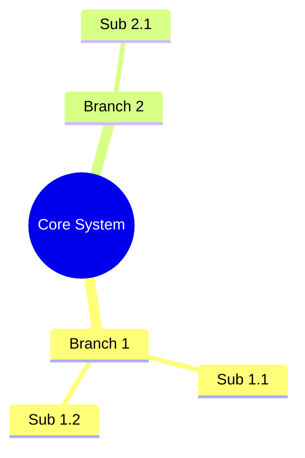

# 🧠 Markmap Architect Skill

This skill guides the agent to distill complex technical specifications, API catalogs, database schemas, and migration plans into **high-density, visually skimmable mindmaps**.

---

## 1. When to Activate This Skill
- The user requests a "mindmap", "sơ đồ tư duy", "read nhanh", or "visual overview".
- Architecture reviews where multi-dimensional dependencies (Pages ↔ APIs ↔ Data Models ↔ Tech Stacks) need to be comprehended in under 60 seconds.
- Pre-migration audits and system modernization roadmaps.

---

## 2. Core Mindmap Engines Supported

### Engine A: Native Mermaid Mindmap (In-chat Markdown)
Used for immediate inline rendering in markdown previewers and IDE chat interfaces:

### Engine B: Interactive Standalone Markmap HTML/SVG (Recommended for Deep Reading)
Creates an interactive, pan-and-zoomable mindmap artifact using `markmap-autoloader`:
- Embeds Markdown unordered lists (`- [ ]`, `- **Node**`).
- Styled with dark/light theme, dotted grid background, and responsive SVG containers.
- Users can collapse/expand sub-branches interactively.

---

## 3. Structural Rules for High-Density Technical Mindmaps
1. **Central Node:** Clear System Name + Target Architecture (e.g. `Belooga Legacy → Next.js 14+`).
2. **Level 1 Branches (4–6 max):**
   - User Journeys / Page Families (16 Routes)
   - API & Service Domains (8 Domains / 72 APIs)
   - Technical Stack & Data Flow (RSC, Server Actions, BFF)
   - Quality & Anti-Hallucination Gates (Asset parity, CSS discipline)
3. **Level 2 Branches:** Grouped functional modules (e.g. `Candidate Workspace`, `Identity & Auth`).
4. **Level 3+ Leaf Nodes:** Concrete endpoints, methods, and payload contracts (`GET /v1/profile/me`, `54px CSS button`).
