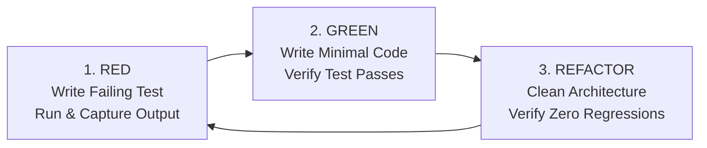

# 🔴🟢 Mandatory TDD Workflow Standard Operating Procedure (SOP)

> **Integrity Contract:** No code modification is permitted without an existing or newly authored failing test (`Red`). All claims of bug fixes or new features must provide empirical terminal evidence of the `Red` failure, the `Green` pass, and post-refactor validation.

---

## 1. The Non-Negotiable 3-Phase Cycle



### Phase 1: RED (Test First & Prove the Defect)
1. **Target Identification:** Identify the specific functional bug, security vulnerability, or new contract.
2. **Author the Test First:** Write a minimal, deterministic unit or integration test in:
   - Backend: `backend/tests/test_<domain>_<feature>.py` (using `pytest`, `pytest-asyncio`, and `httpx.AsyncClient`).
   - Frontend/QC: `qc/tests/e2e/<page>.spec.ts` or component test.
3. **Run and Capture Failure:** Execute the test *before* making any source code modifications. The test MUST fail with the expected root cause (e.g. `AssertionError: 400 != 500`, `InvalidRequestError`, or `Path traversal not blocked`).
4. **Log Empirical Proof:** Output the failing test terminal log in the work log or conversation transcript.

### Phase 2: GREEN (Minimal Sane Fix)
1. **Apply the Minimal Code Change:** Implement the exact logic required to make the failing test pass. Do not write speculative, unrequested abstractions.
2. **Execute the Test Suite:** Re-run the failing test and verify it passes (`PASSED [100%]`).
3. **Verify Edge Cases:** Add boundary test cases (e.g. empty strings, null tokens, non-existent UUIDs, malicious path prefixes).

### Phase 3: REFACTOR & Regression Verification
1. **Clean Code & Architecture:** Eliminate code duplication, improve readability, and ensure non-blocking I/O (`asyncio.to_thread`).
2. **Full Suite Regression Run:** Run the entire test suite (`pytest backend/tests/ -v` and `bun run test:e2e`).
3. **No Weakening of Tests:** Never delete or weaken test assertions (e.g. removing waits or assertions) to make a failing test pass.

---

## 2. Prohibited Anti-Patterns

| Anti-Pattern | Description | Consequence |
|---|---|---|
| **Code-First / Test-Never** | Writing 500+ lines of backend logic without a single automated test. | **IMMEDIATE REJECTION** |
| **Assertion Weakening** | Deleting assertions or removing timeouts without proper clock simulation (`page.clock`). | **INTEGRITY VIOLATION** |
| **Blind Scripting** | Writing test scripts that always exit 0 regardless of real errors. | **ZERO TOLERANCE** |
| **Mock Hallucination** | Hardcoding fake mock return values in tests that do not match production database schemas. | **REJECTED** |

---

## 3. Standard Verification Commands

```bash
# 1. Backend Integration Tests (Real PostgreSQL Container)
backend/.venv/bin/pytest backend/tests/ -v

# 2. Specific Security Regression Tests
backend/.venv/bin/pytest backend/tests/test_media_traversal.py -v
backend/.venv/bin/pytest backend/tests/test_timeline_reorder.py -v
backend/.venv/bin/pytest backend/tests/test_auth_family_rotation.py -v
backend/.venv/bin/pytest backend/tests/test_idor_guards.py -v

# 3. Frontend Typecheck & E2E
cd frontend && bun x tsc --noEmit
cd qc && bun run test:e2e
```
