# 🐋 BELOOGA — Project Conversion Master Template & Migration Blueprint
> **Ground-Truth Architecture, Route Inventory, Anti-Hallucination Harness & Conversion Execution Standard**  
> *Targeted for converting legacy `farmer911/beloga` (CRA / Redux / Stack Theme) into a Modern High-Performance Stack (Next.js / Vite + React / TypeScript).*

---

## 📋 Executive Overview & Conversion Mission

### 1.1 Project Identity & Core Value Proposition
**Belooga** is an interactive career discovery and candidate presentation platform designed to modernize traditional recruitment. Instead of static, text-heavy CVs, Belooga pairs candidate profiles and traditional credentials directly with an authentic **30-second video elevator pitch**.

### 1.2 The Conversion Mandate
* **Target:** Migrate the legacy Create-React-App / Redux / SCSS-Stack-Theme codebase into a clean, modern, type-safe web framework (e.g. Next.js 14+ App Router or Vite + React + TypeScript).
* **Guiding Standard:** 100% adherence to the **Anti-Hallucination Harness** (`legacy-ground-truth-enforcement`).
* **Zero Guesswork / Zero Synthetic Assets:**
  - All visual assets, logos, brand illustrations, and avatars must strictly originate from verified legacy assets in `/public/images/`.
  - All route names, form field schemas, data models, and UI behaviors must preserve exact parity with historical source records (`src/scenes/` and `legacy-inventory.md`).
  - No speculative CSS or imaginary iconography allowed.

---

## 🛡️ Anti-Hallucination Engineering Harness (Lessons Learned & Violations Register)

Any sub-agent or engineer converting Belooga MUST review and obey these 4 hard rules derived from past regressions:

| ID | Historical Violation | Root Cause | Strict Operational Rule |
| :--- | :--- | :--- | :--- |
| **V-001** | Hand-crafted synthetic SVG logo | Guessed dolphin/whale geometry instead of checking repo assets | **NEVER create synthetic SVG logos.** Always use literal `/images/logo-big.png` from original repo. |
| **V-002** | Video play overlay displayed statically on card | Failed to read CSS hover pseudoclasses | **Card play overlay (`.modal-start`) must default to `display: none;`** and ONLY reveal on card `:hover`. |
| **V-003** | Injected FontAwesome icon into play button | Over-engineered instead of inspecting legacy Stack Theme | **Play button is a 54px white circle with pure CSS triangle** (`:before` border trick). No icon fonts. |
| **V-004** | Global `.modal-trigger` styled with `height: 240px; background: #1e293b` | Reused a card trigger class globally, turning hover buttons into black ovals | **NEVER attach layout styles to generic trigger/behavioral classes.** Must verify interactive states in a live browser. |

### 🔒 Mandatory Verification Gate
Before declaring any route or component "Done":
1. **Interactive State Check:** Inspect default, hover, active, focus, and modal-open states.
2. **Visual Parity Check:** Compare against the ground-truth mockups served at `http://localhost:3030/`.
3. **Asset Integrity Check:** Confirm every `` and background image resolves to a verified file in `/images/`.

---

## 🗺️ Complete 16-Route Inventory & Parity Matrix

The Belooga application surface encompasses **16 verified route families**:

```mermaid
graph TD
    App["Belooga Web Application Shell"]
    App --> PublicRoutes["Public & Marketing Routes"]
    App --> AuthRoutes["Authentication & Onboarding"]
    App --> CandidateRoutes["Candidate Workspace & Profile"]
    App --> SearchRoutes["Talent Discovery & Search"]
    App --> LegalUtilityRoutes["Legal & Utility Routes"]

    PublicRoutes --> R01["Route 01: Home ('/' & '/home')"]
    PublicRoutes --> R14["Route 14: Blog ('/blog', '/blog/:slug')"]
    PublicRoutes --> R13["Route 13: Careers ('/careers', '/careers/:id')"]
    PublicRoutes --> R12["Route 12: Help Center ('/help', '/help-faqs')"]
    PublicRoutes --> R11["Route 11: Contact Us ('/contact-us')"]

    AuthRoutes --> R02["Route 02: Login ('/login')"]
    AuthRoutes --> R03["Route 03: Register ('/register')"]
    AuthRoutes --> R04["Route 04: Forgot Password ('/forgot-password')"]
    AuthRoutes --> R15["Route 15: OAuth Handshake ('/callback')"]

    CandidateRoutes --> R05["Route 05: Workspace Profile ('/user/:username')"]
    CandidateRoutes --> R06["Route 06: Update Profile ('/user/:username/update-profile')"]
    CandidateRoutes --> R07["Route 07: Account Settings ('/user/:username/account-setting')"]
    CandidateRoutes --> R09["Route 09: Public Candidate View ('/public/:username')"]

    SearchRoutes --> R08["Route 08: Search Talent ('/user/search/?key=&page=')"]

    LegalUtilityRoutes --> R10A["Route 10A: Privacy Policy ('/privacy-policy')"]
    LegalUtilityRoutes --> R10B["Route 10B: Terms & Conditions ('/terms-and-conditions')"]
    LegalUtilityRoutes --> R16["Route 16: Not Found 404 ('/404-not-found')"]
```



### Detailed Route Specifications Table

| Route ID | Route Family / URL | Legacy Component (`src/scenes/`) | Target File / Page | Key Functional Blocks & UI Features | Ground-Truth Assets Needed |
| :---: | :--- | :--- | :--- | :--- | :--- |
| **01** | `/` & `/home` | `home/home.scene.tsx` | `index.html` / `app/page.tsx` | • Hero headline & CTA buttons<br>• Video walkthrough cards (Ava & Inspire) with modal video popups<br>• Elevator pitch candidate cards (Jazmin, Jeremy, Rileigh)<br>• 4-step recruitment workflow showcase | `/images/logo-big.png`<br>`/images/home/Ana.png`<br>`/images/home/Inspire.png`<br>`/images/home/matt-poster.png`<br>`/images/Jazmin-1.jpg`, etc. |
| **02** | `/login` | `login/login.scene.tsx` | `login.html` / `app/login/page.tsx` | • Social OAuth buttons (Facebook, Google, LinkedIn)<br>• Username/Email + Password form<br>• Split layout with `#d7ecea` overlay tint<br>• "Forgot password" & "Create account" links | `/images/logo-big.png`<br>`/images/login-background.jpg` |
| **03** | `/register`, `/register/:provider` | `register/register.scene.tsx` | `register.html` / `app/register/page.tsx` | • Fast social signup buttons<br>• First Name, Last Name, Username rule check<br>• Email & Password fields<br>• Terms & Privacy policy checkbox | `/images/logo-big.png`<br>`/images/login-background.jpg` |
| **04** | `/forgot-password`, `/reset-password` | `forgot-password/forgot_password.scene.tsx` | `forgot-password.html` / `app/forgot-password/page.tsx` | • Email input for password reset<br>• Instructions alert banner<br>• Back to login navigation link | `/images/logo-big.png`<br>`/images/login-background.jpg` |
| **05** | `/user`, `/user/:username` | `user/user.scene.tsx` & `profile/profile.scene.tsx` | `user.html` / `app/user/[username]/page.tsx` | • **Candidate Workspace Dashboard**<br>• Left Sidebar: Avatar, Full Name, Headline, Contact channels, Bio, Skill tags, Languages, Interests<br>• Main Content: **0:30 Video Elevator Pitch**, Experience timeline, Education history, Download PDF Resume attachment | `/images/avatar.jpg`<br>`/images/logo-big.png`<br>`/videos/home/Ava_s_Video.mp4` |
| **06** | `/user/:username/update-profile` | `user/update-user/update-user.scene.tsx` | `update-profile.html` / `app/user/[username]/update/page.tsx` | • Avatar upload & crop trigger<br>• Personal information fields (First/Last name, Headline, Location)<br>• Bio markdown editor / textarea<br>• Social link inputs (LinkedIn, GitHub, Website) | `/images/avatar.jpg` |
| **07** | `/user/:username/account-setting` | `user/account-setting/account-setting.scene.tsx` | `account-setting.html` / `app/user/[username]/settings/page.tsx` | • Primary account email modification<br>• Password change form (Current, New, Confirm)<br>• Notification preference toggles<br>• Danger zone: Delete account modal | System form controls |
| **08** | `/user/search/?key=&page=` | `search-result/search_result.scene.tsx` | `search.html` / `app/search/page.tsx` | • Search input bar with instant query param sync<br>• Results count header<br>• Candidate card grid with "0:30 Pitch" badge & avatar<br>• Pagination controls (`« 1 2 3 »`) | `/images/avatar.jpg`<br>`/images/Jeremy-1.jpg`, etc. |
| **09** | `/public/:username` | `public/public.scene.tsx` | `public-profile.html` / `app/public/[username]/page.tsx` | • Read-only sharable candidate view<br>• Floating/Top action bar: "Export PDF Resume", "Report Profile", "Contact"<br>• Video elevator pitch preview<br>• Full credentials layout | `/images/avatar.jpg`<br>`/images/logo-big.png` |
| **10A** | `/privacy-policy` | `privacy-policy/privacy-policy.scene.tsx` | `privacy-policy.html` / `app/privacy-policy/page.tsx` | • Legal privacy documentation<br>• Candidate data handling & video storage disclaimers | Text content |
| **10B** | `/terms-and-conditions` | `terms-and-conditions/terms-and-conditions.scene.tsx` | `terms-and-conditions.html` / `app/terms-and-conditions/page.tsx` | • User agreement & platform rules<br>• Intellectual property & video submission guidelines | Text content |
| **11** | `/contact-us` | `contact-us/contact-us.scene.tsx` | `contact-us.html` / `app/contact-us/page.tsx` | • Support inquiry form inside `boxed boxed--border`<br>• Name, Email, Subject, Message textarea<br>• Office contact details & email channels | `/images/logo-big.png` |
| **12** | `/help`, `/help-faqs`, `/video-tutorials` | `help/help.scene.tsx` & `help-faqs.scene.tsx` | `help.html` / `app/help/page.tsx` | • Help Center search bar<br>• Topic cards (General FAQs, Video Tutorial Guides)<br>• Collapsible accordion question toggles | Icons & vector symbols |
| **13** | `/careers`, `/careers/:id` | `careers/careers-page.scene.tsx` | `careers.html` / `app/careers/page.tsx` | • Belooga company mission statement<br>• Department filters (Engineering, Product, Marketing)<br>• Open positions listing cards with "Apply Now" triggers | `/images/logo-big.png` |
| **14** | `/blog`, `/blog/:blogslug` | `blog/blog.scene.tsx` | `blog.html` / `app/blog/page.tsx` | • Featured hero editorial article (`banner-blog.png`)<br>• 3-column article grid (`blog-1.jpg`, `blog-2.jpg`)<br>• Read time, publish date, author badges | `/images/blog/banner-blog.png`<br>`/images/blog/blog-1.jpg` |
| **15** | `/social-connect-scene`, `/callback` | `app/` & OAuth callbacks | `app/auth/callback/page.tsx` | • OAuth popup receiver and session token handshake<br>• Redirection handler to `/user/:username` | Background token handler |
| **16** | `/404-not-found` & wildcard | `not-found/not-found.scene.tsx` | `404.html` / `app/not-found.tsx` | • Dark branded error screen (`#1e293b`)<br>• "404" heading + descriptive message<br>• "Return to Home" button | `/images/logo-big.png` |

---

## 🎨 Design Tokens, Color Palette & Typography

All styles must map directly to these tokens extracted from `src/styles/variables.module.scss` and `custom-theme.scss`:

### 3.1 CSS Design Tokens
```css
:root {
  /* Brand Primary & Accents */
  --main-color: #5bbbae;         /* Belooga Signature Seafoam Teal */
  --main-color-hover: #497d76;   /* Darkened Hover Teal */
  --accent-teal: #3fc6b7;        /* Vibrant Secondary Teal */
  --dark-teal: #21655e;          /* Deep Contrast Anchor */
  --action-blue: #39a0e8;        /* Informational Links / Secondary Action */
  --bg-auth-overlay: #d7ecea;    /* Translucent Auth Page Overlay */

  /* Neutral & Typography Colors */
  --text-color: #252525;         /* Primary Headings & Dark Text */
  --text-heading: #515151;       /* Subheadings & Card Titles */
  --text-body: #666666;          /* Body Text */
  --text-muted: #737475;         /* Metadata, Labels, Footers */
  --text-inverse: #ffffff;       /* Pure White Text */

  /* Surface, Backgrounds & Dividers */
  --bg-page: #f8f9fa;            /* Light Background Tint */
  --bg-white: #ffffff;           /* Elevated Card Surface */
  --border-color: #d1d6da;       /* Standard Input / Card Border */
  --border-subtle: #f8f9fa;      /* Subtle Separator */
  --border-light: #fafafa;       /* Light Separator */

  /* Elevation & Shadows */
  --box-shadow-card: 0 2px 16px 0 rgba(187, 187, 187, 0.12);
  --box-shadow-wide: 0 10px 30px 0 rgba(0, 0, 0, 0.08);
  --box-shadow-media: 0 0 50px #b8b5b5; /* Legacy video card shadow */

  /* Typography */
  --font-family-base: -apple-system, BlinkMacSystemFont, "Segoe UI", Roboto, Helvetica, Arial, sans-serif;
  --font-size-base: 14px;
  --line-height-base: 1.6;
}
```

### 3.2 Exact Video Play Button Specification
```css
/* Card Container */
.start-content-video {
  position: relative;
  overflow: hidden;
  border-radius: 6px;
}

/* Play Overlay - Hidden by default, revealed on hover */
.start-content-video .modal-start {
  position: absolute;
  top: 0;
  left: 0;
  width: 100%;
  height: 100%;
  display: none; /* Crucial: do not show statically */
  align-items: center;
  justify-content: center;
  background: rgba(0, 0, 0, 0.35);
  transition: opacity 0.2s ease;
  z-index: 2;
}

.start-content-video:hover .modal-start {
  display: flex;
}

/* 54px Circular Button */
.video-play-icon {
  width: 54px;
  height: 54px;
  background: #ffffff;
  border-radius: 50%;
  display: flex;
  align-items: center;
  justify-content: center;
  position: relative;
  box-shadow: 0 4px 12px rgba(0, 0, 0, 0.25);
  transition: transform 0.2s ease;
}

.start-content-video:hover .video-play-icon {
  transform: scale(1.08);
}

/* Pure CSS Play Triangle (Stack Theme Standard) */
.video-play-icon:before {
  content: "";
  display: block;
  width: 0;
  height: 0;
  border-style: solid;
  border-width: 8px 0 9px 13px;
  border-color: transparent transparent transparent #5bbbae;
  margin-left: 3px;
}
```

---

## 🏗️ Target Architecture & Recommended Tech Stack

When modernizing Belooga, adhere to this clean, decoupled architecture:

### 4.1 Recommended Modern Stack
* **Framework:** Next.js 14+ (App Router) or Vite + React 18 / 19
* **Language:** TypeScript 5+ (Strict Mode)
* **Styling:** CSS Modules or Tailwind CSS configured with Belooga design tokens
* **State Management:** Zustand (for lightweight candidate state) + TanStack Query (replacing legacy Redux / Saga boilerplate)
* **Form Handling & Validation:** React Hook Form + Zod (matching legacy field schemas)
* **Media / Video Player:** Native HTML5 Video with custom controls or Video.js / Plyr wrapper supporting 0:30 clips
* **PDF Handling:** `@react-pdf/renderer` or native Canvas-based viewer for resume export

### 4.2 Modern Directory Structure
```
belooga-web/
├── public/
│   ├── images/              <-- Literal legacy assets copied directly
│   │   ├── logo-big.png
│   │   ├── avatar.jpg
│   │   ├── home/
│   │   └── blog/
│   └── videos/
│       └── home/Ava_s_Video.mp4
├── src/
│   ├── app/                 <-- Route pages matching 16 route families
│   │   ├── layout.tsx       <-- Root Shell with Header & Footer
│   │   ├── page.tsx         <-- Route 01: Home
│   │   ├── (auth)/
│   │   │   ├── login/page.tsx
│   │   │   ├── register/page.tsx
│   │   │   └── forgot-password/page.tsx
│   │   ├── user/
│   │   │   └── [username]/
│   │   │       ├── page.tsx          <-- Route 05: Workspace Profile
│   │   │       ├── update/page.tsx   <-- Route 06: Update Profile
│   │   │       └── settings/page.tsx <-- Route 07: Account Settings
│   │   ├── search/page.tsx           <-- Route 08: Candidate Search
│   │   ├── public/[username]/page.tsx<-- Route 09: Public View
│   │   ├── blog/page.tsx             <-- Route 14: Blog
│   │   ├── careers/page.tsx          <-- Route 13: Careers
│   │   ├── help/page.tsx             <-- Route 12: Help Center
│   │   ├── contact-us/page.tsx       <-- Route 11: Contact Us
│   │   ├── privacy-policy/page.tsx   <-- Route 10A
│   │   ├── terms-and-conditions/page.tsx <-- Route 10B
│   │   └── not-found.tsx             <-- Route 16: 404
│   ├── components/
│   │   ├── layout/Header.tsx
│   │   ├── layout/Footer.tsx
│   │   ├── video/VideoElevatorPlayer.tsx  <-- 0:30 Video Pitch Component
│   │   ├── profile/ProfileSidebar.tsx
│   │   ├── profile/ExperienceTimeline.tsx
│   │   └── search/CandidateCard.tsx
│   ├── styles/
│   │   ├── tokens.css       <-- Exact Belooga CSS Variables
│   │   └── globals.css
│   └── types/               <-- Candidate, Profile, Experience, Education
```

---

## 🚀 Step-by-Step Conversion Execution Template

Follow these 6 standardized phases to convert the project systematically:

### Phase 1: Foundation & Asset Ingestion
1. Initialize repository (`npx create-next-app@latest` or `npm create vite@latest`).
2. Copy the verified assets folder `/images/` and `/videos/` directly into `/public/`.
3. Ingest `tokens.css` into the root stylesheet.
4. Set up the Anti-Hallucination Harness rules in `.agents/rules/anti-hallucination-harness.md`.

### Phase 2: Application Shell (Header & Footer)
1. Build `Header` component:
   - Left: Logo (`/images/logo-big.png`) linking to `/`.
   - Right (Unauthenticated): "Log in" button + "Sign up" button.
   - Right (Authenticated): Search bar trigger + Avatar thumbnail dropdown (`My Profile`, `Settings`, `Log out`).
2. Build `Footer` component:
   - Brand column with mission statement & copyright.
   - Navigation links: About, Careers, Blog, Help, Contact.
   - Legal links: Privacy Policy, Terms & Conditions.
3. Test responsive mobile drawer menu.

### Phase 3: Public Marketing Pages (Routes 01, 11, 12, 13, 14)
1. **Home (`/`):**
   - Hero banner with headline & dual CTA ("Find Talent" / "Create Profile").
   - Walkthrough cards with video modal trigger (`Ava_s_Video.mp4`).
   - Pitch cards with verified `:hover` play circle behavior.
   - 4-step hiring process layout.
2. **Blog (`/blog`):** Hero editorial banner + 3-column article cards.
3. **Careers (`/careers`):** Culture description + department-filtered job cards.
4. **Help Center (`/help`):** Topic cards + interactive accordion FAQ.
5. **Contact Us (`/contact-us`):** Support form with feedback state.

### Phase 4: Authentication Flow (Routes 02, 03, 04, 15)
1. **Split-Screen Layout:** Branded background image + `#d7ecea` overlay tint.
2. **Social OAuth Buttons:** Facebook, Google, LinkedIn.
3. **Forms:** Form state, validation feedback, and redirection to `/user/:username`.
4. **Password Reset:** Email dispatch trigger & success notification.

### Phase 5: Candidate Core Workspace (Routes 05, 06, 07, 09)
1. **Workspace Layout (`/user/:username`):**
   - 2-Column Grid: 320px left sticky sidebar + flexible main area.
   - Sidebar: Avatar, Full Name, Title, Contact badges, Skills tags, Languages, Social links.
   - Main Area:
     - **0:30 Video Pitch Player** with poster image & play/pause timer.
     - Experience timeline (Company, Role, Dates, Description).
     - Education cards (Institution, Degree, Dates).
     - Resume PDF download button.
2. **Profile Editor (`/user/:username/update-profile`):**
   - Editable fields with instant preview.
   - Avatar file picker.
3. **Account Settings (`/user/:username/account-setting`):**
   - Email update, password rotation, Danger Zone account deletion modal.
4. **Public Profile (`/public/:username`):**
   - Clean, sharable read-only view with "Export PDF" action.

### Phase 6: Talent Discovery & Search (Route 08)
1. Filter & search bar (`/user/search/?key=&page=`).
2. Candidate card grid displaying:
   - Candidate avatar & location.
   - "0:30 Pitch" preview badge.
   - Primary skills tags.
   - "View Profile" link.
3. Pagination controls and empty state ("No candidates found").

---

## 🔍 Quality Assurance & Verification Checklist

Before accepting any converted page or release:

- [ ] **Zero Hallucination Audit:** No invented SVG icons or placeholder external images (e.g. Unsplash/LoremFlickr).
- [ ] **Brand Color Parity:** Seafoam teal `#5bbbae` used for primary actions, `#d7ecea` for auth tints.
- [ ] **Video Hover Test:** Verify video play overlay remains hidden until hovered over, and play button renders as a 54px circle with pure CSS triangle.
- [ ] **Live Browser Verification:** Visual screenshot captured via browser subagent across Desktop (1440px), Tablet (768px), and Mobile (375px).
- [ ] **Navigation Parity:** All 16 routes resolve without 404s, redirect loops, or broken anchors.
- [ ] **State Parity:** Auth state toggles cleanly between visitor mode and candidate workspace mode.

---
*Template Author: Belooga Engineering Team & Original System Creator*  
*Reference Repository: `farmer911/beloga`*  
*Local Verified Mirror: `http://localhost:3030/`*
