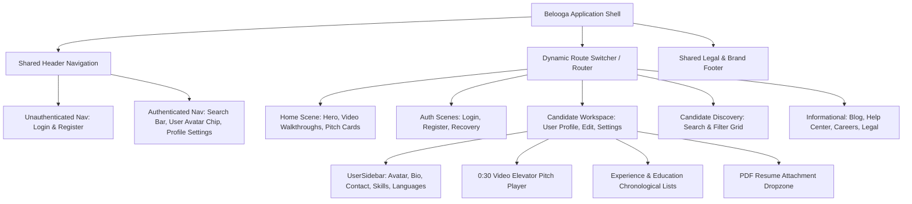

# 🐋 BELOOGA — Master Migration & Conversion Blueprint
> **Ground-Truth Architecture, Route Inventory & Conversion Standard**  
> *Derived from legacy source repository `farmer911/beloga`, technical planning audits in `/Users/phucnguyen/Documents/Codex/`, and verified local UI mockups.*

---

## 1. Executive Summary & Conversion Mission

### 1.1 Project Identity
**Belooga** is an interactive career discovery and candidate presentation platform designed to revolutionize traditional hiring. Instead of flat, text-only resumes, Belooga pairs candidate profiles and traditional credentials directly with an impactful **30-second video elevator pitch**.

### 1.2 Conversion Mandate
* **Target Objective:** Full conversion from the legacy Create-React-App / Redux / Stack-Theme codebase (`farmer911/beloga`) into a clean, modern, high-performance web architecture.
* **Strict Quality Protocol:** 100% adherence to the **Anti-Hallucination Harness** (`legacy-ground-truth-enforcement`).
* **Zero Guesswork / Zero Hallucination:** 
  - All icons, logos, illustrations, and media must strictly originate from verified legacy assets in `/public/images/`.
  - All route names, form field schemas, and layouts must match historical source records (`src/scenes/` and `legacy-inventory.md`).

---

## 2. Complete Legacy Route Inventory & Parity Matrix (All 16 Routes)

The complete application surface covers **16 verified route families** across public, authentication, candidate workspace, administrative, content, and utility pages:

| Route ID | Route Family / URL | Legacy Source Component (`src/scenes/`) | Target HTML Mockup | Verified Surface & Functional Blocks | Asset & API Dependencies |
| :---: | :--- | :--- | :--- | :--- | :--- |
| **01** | `/` and `/home` | `home/home.scene.tsx` | [`index.html`](file:///Users/phucnguyen/Dev/Beloga/index.html) | Hero headline, video walkthroughs (Ava & Inspire), elevator pitch cards (Jazmin, Jeremy, Rileigh), step-by-step feature showcase | `logo-big.png`, `home/Ana.png`, `home/Inspire.png`, `home/matt-poster.png` |
| **02** | `/login` | `login/login.scene.tsx` | [`login.html`](file:///Users/phucnguyen/Dev/Beloga/login.html) | Social OAuth buttons (Facebook, Google, LinkedIn), Username/Email & Password form, recovery redirect links | `login-background.jpg`, Social Auth APIs (`BE-01`, `BE-06`) |
| **03** | `/register`, `/register/:provider` | `register/register.scene.tsx` | [`register.html`](file:///Users/phucnguyen/Dev/Beloga/register.html) | Social fast registration, First/Last Name, Username rule check, Email, Password, Terms & Privacy consent | Social Auth APIs (`BE-01`, `BE-06`, `BE-08`) |
| **04** | `/forgot-password`, `/reset-password` | `forgot-password/forgot_password.scene.tsx` | [`forgot-password.html`](file:///Users/phucnguyen/Dev/Beloga/forgot-password.html) | Password recovery email submission, dispatch confirmation alert, token reset gateway | Email Dispatch & Token Lifecycle (`BE-01`, `BE-08`) |
| **05** | `/user`, `/user/:username` | `user/user.scene.tsx` & `profile/profile.scene.tsx` | [`user.html`](file:///Users/phucnguyen/Dev/Beloga/user.html) | Authenticated Candidate Profile Workspace: Left Sidebar (User avatar, headline, contact channels, bio, skills, languages, interests) + Main Area (0:30 Video Resume Pitch, Experience timeline, Education, PDF Resume attachment) | Candidate Profile API (`BE-02`, `BE-03`), PDF export worker |
| **06** | `/user/:username/update-profile` | `user/update-user/update-user.scene.tsx` | [`update-profile.html`](file:///Users/phucnguyen/Dev/Beloga/update-profile.html) | Candidate Profile Editor: Avatar file picker, First/Last name, Headline, Location, Bio text, Social URL bindings | Candidate Profile Mutation API (`BE-02`, `BE-03`) |
| **07** | `/user/:username/account-setting` | `user/account-setting/account-setting.scene.tsx` | [`account-setting.html`](file:///Users/phucnguyen/Dev/Beloga/account-setting.html) | Primary email update, password rotation form, irreversible account deletion danger zone | Identity & Account Deletion Policy (`BE-01`, `BE-02`) |
| **08** | `/user/search/?key=&page=` | `search-result/search_result.scene.tsx` | [`search.html`](file:///Users/phucnguyen/Dev/Beloga/search.html) | Candidate discovery search bar, results count header, card grid with 0:30 video pitch thumbnail badges, pagination controls | Candidate Search & Ranking API (`BE-07`) |
| **09** | `/public/:username` | `public/public.scene.tsx` | [`public-profile.html`](file:///Users/phucnguyen/Dev/Beloga/public-profile.html) | Public candidate profile view: Sharable web CV, report profile modal trigger, export vector PDF | Public Candidate Query API (`BE-02`, `BE-07`) |
| **10A**| `/privacy-policy` | `privacy-policy/privacy-policy.scene.tsx` | [`privacy-policy.html`](file:///Users/phucnguyen/Dev/Beloga/privacy-policy.html) | Legal privacy statement, data collection clauses, candidate media storage disclosures | Static Content (`BE-07`) |
| **10B**| `/terms-and-conditions` | `terms-and-conditions/terms-and-conditions.scene.tsx` | [`terms-and-conditions.html`](file:///Users/phucnguyen/Dev/Beloga/terms-and-conditions.html) | Terms of service, candidate content authenticity agreement, platform acceptable use rules | Static Content (`BE-07`) |
| **11** | `/contact-us` | `contact-us/contact-us.scene.tsx` | [`contact-us.html`](file:///Users/phucnguyen/Dev/Beloga/contact-us.html) | Contact form (`boxed boxed--border`): Name, Email, Subject, Message, submission feedback alert | Inquiries Dispatch API (`BE-07`) |
| **12** | `/help`, `/help-faqs`, `/video-tutorials` | `help/help.scene.tsx` & `help-faqs.scene.tsx` | [`help.html`](file:///Users/phucnguyen/Dev/Beloga/help.html) | Help Center hub, category cards (FAQs, Video Tutorials), interactive accordion question toggles | Help Content API (`BE-07`) |
| **13** | `/careers`, `/careers/:id` | `careers/careers-page.scene.tsx` | [`careers.html`](file:///Users/phucnguyen/Dev/Beloga/careers.html) | Career Center: Open engineering and product listings, department/location badges, application action triggers | Recruiting Service (`BE-07`) |
| **14** | `/blog`, `/blog/:blogslug` | `blog/blog.scene.tsx` | [`blog.html`](file:///Users/phucnguyen/Dev/Beloga/blog.html) | Insights hub: Hero featured editorial banner (`banner-blog.png`), read time/category, article cards grid (`blog-1.jpg`) | Blog CMS API (`BE-07`) |
| **15** | `/social-connect-scene`, `/callback` | `app/` & OAuth callbacks | Included in Social Auth flow | Provider token handshake, LinkedIn popup callback gateway | Social OAuth Engine (`BE-06`) |
| **16** | `/404-not-found` & unmatched paths | `not-found/not-found.scene.tsx` | [`404.html`](file:///Users/phucnguyen/Dev/Beloga/404.html) | Dark branded error boundary, large 404 display, return to homepage link | Client router error boundary (`BE-08`) |

---

## 3. Design System Tokens & Visual Foundations

Extracted directly from `src/styles/variables.module.scss`, `custom-theme.scss`, and `theme.scss`:

```css
:root {
  /* Brand Primary & Accents */
  --main-color: #5bbbae;         /* Belooga Signature Seafoam Teal */
  --main-color-hover: #497d76;   /* Darkened Interaction Teal */
  --accent-teal: #3fc6b7;        /* Vibrant Gradient Start */
  --dark-teal: #21655e;          /* High-Contrast Anchor */
  --action-blue: #39a0e8;        /* Informational Links & Accents */
  --bg-auth-overlay: #d7ecea;    /* Translucent Auth Page Overlay Tint */

  /* Neutral & Text Typography Colors */
  --text-color: #252525;         /* Primary Headings & Dark Text */
  --text-heading: #515151;       /* Card Subtitles & Titles */
  --text-body: #666666;          /* Body Copy */
  --text-muted: #737475;         /* Fine Print & Captions */
  --text-inverse: #ffffff;       /* Pure White Text */

  /* Surface, Background & Borders */
  --bg-page: #f8f9fa;            /* Default Canvas Neutral Tint */
  --bg-white: #ffffff;           /* Elevated Card Surface */
  --border-color: #d1d6da;       /* Standard Border */
  --border-subtle: #f8f9fa;      /* Faint Divider */
  --border-light: #fafafa;       /* Card Separator */

  /* Elevation & Shadows */
  --box-shadow-card: 0 2px 16px 0 rgba(187, 187, 187, 0.12);
  --box-shadow-wide: 0 10px 30px 0 rgba(0, 0, 0, 0.08);
  --box-shadow-media: 0 0 50px #b8b5b5; /* Verified legacy video border shadow */
}
```

### 3.1 Strict Icon & Play Button Geometry Standard
To prevent visual regressions:
* **Video Play Icon:** Must be an exact `54px × 54px` circle (`background: #ffffff`, `border-radius: 50%`, centered via flexbox/absolute transform).
* **Play Triangle:** Generated via pure CSS pseudo-element `:before` with `border-width: 8px 0 9px 13px; border-color: transparent transparent transparent #9b9b9b; margin-top: -8.5px; margin-left: -4px;`.
* **Zero Global CSS Pollution:** Never inject dimension (`height`, `width`, `background`) styles into generic behavioral triggers like `.modal-trigger` or `.modal-instance`.

---

## 4. Component Architecture & Conversion Hierarchy



---

## 5. Engineering Quality Harness (Operational Violations Log)

All developers and sub-agents working on conversion tasks must review the recorded mistakes in [`VIOLATIONS_REGISTER.md`](file:///Users/phucnguyen/Dev/Beloga/VIOLATIONS_REGISTER.md) to prevent regressions:

1. **[VIOLATION-001] Avoid Synthetic / Approximate SVGs:**
   - *Rule:* Always copy or reference literal binary files (`/images/logo-big.png`) from `farmer911/beloga/public/images/`. Never hand-craft approximation paths.
2. **[VIOLATION-002] Static vs. Hover State Discipline:**
   - *Rule:* Video play overlays (`.modal-start`) default to `display: none;` and only reveal on card hover (`.start-content-video:hover`).
3. **[VIOLATION-003] CSS-First Theme Parity:**
   - *Rule:* Retain Stack Theme pure CSS triangle buttons; do not substitute oversized font-icon elements.
4. **[VIOLATION-004] CSS Collision & Mandatory Browser Verification:**
   - *Rule:* Never pollute global behavioral classes (`.modal-trigger`). Always verify interactive states (hover, modals) using live browser subagents before declaring tasks complete.

---

## 6. Step-by-Step Conversion Execution Template

When initiating conversion for a new target framework (e.g. Next.js, Vite React, or Remix):

### Step 1: Asset & Token Ingestion
- Copy all verified assets from `/Users/phucnguyen/Dev/Beloga/images/` to the target asset pipeline (`/public/images/` or `/src/assets/`).
- Import `--main-color` and theme tokens into global CSS variables or Tailwind token configuration.

### Step 2: Global Shell Scaffolding
- Implement `<Header>` matching `src/commons/components/header/header.tsx` with authenticated vs. unauthenticated state switches.
- Implement `<Footer>` matching `src/commons/components/footer/footer.tsx` with full legal navigation and social links.
- Embed the top Harness Control Bar for developer review.

### Step 3: Route-by-Route Component Implementation
- **Batch 1 (Public & Marketing):** Convert `index.html` (Route 01), `blog.html` (Route 14), `careers.html` (Route 13), `help.html` (Route 12), `contact-us.html` (Route 11).
- **Batch 2 (Auth & Onboarding):** Convert `login.html` (Route 02), `register.html` (Route 03), `forgot-password.html` (Route 04).
- **Batch 3 (Candidate Workspace Core):** Convert `user.html` (Route 05), `public-profile.html` (Route 09), `update-profile.html` (Route 06), `account-setting.html` (Route 07).
- **Batch 4 (Discovery & Search):** Convert `search.html` (Route 08) with query string synchronization.

### Step 4: Video Player & PDF Upload Integration
- Implement HTML5 video player with fallback poster support (`/videos/home/Ava_s_Video.mp4`, `matt-poster.png`).
- Implement drag-and-drop PDF resume attachment component with preview modal.

### Step 5: Visual Regression & Browser Verification Gate
- Run automated visual screenshot comparisons against the verified mockups in `/Users/phucnguyen/Dev/Beloga/`.
- Verify responsive layout across Desktop (1440px), Tablet (768px), and Mobile (375px).
- Verify all interactive hover states produce zero geometric distortion.
