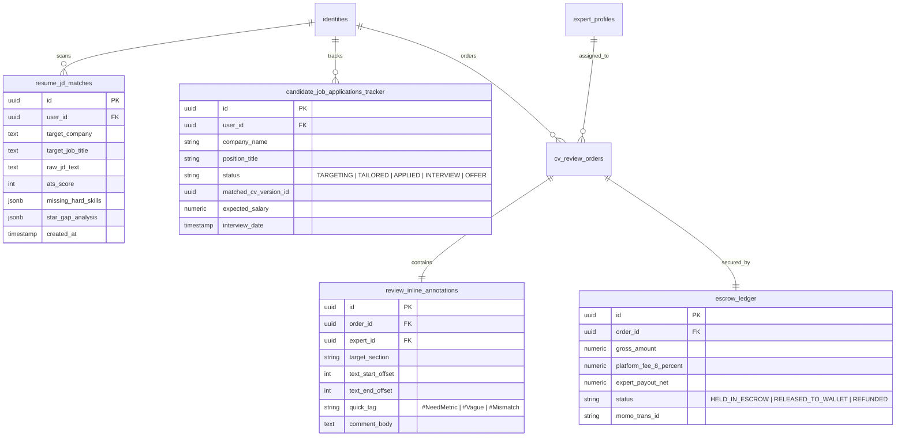

# Kế Hoạch Tính Năng Thiếu & Thiết Kế Layout UI Siêu Mật Độ (High-Density UI)

> **Mã tài liệu:** `PLAN-002-UI-ECOSYSTEM`  
> **Trạng thái:** Sẵn sàng cho triển khai giao diện & API (Design-First Specification)  
> **Nguyên lý thiết kế:** *"Zero Dead-Space (Không khoảng trắng vô nghĩa) - Linear & Bloomberg Terminal Productivity Density - Truy xuất nguồn gốc 100%".*

---

## 1. Bảng Đối Soát Tính Năng & Bằng Chứng Thực Tế (Feature Gap & Evidence Traceability)

Đối soát trực tiếp giữa **Mã nguồn thực tế hiện có** (`CURRENT_STATE.md` §1, §2, §3) và **Hệ sinh thái mục tiêu** để đảm bảo không lệch pha:

| Trụ cột hệ sinh thái | Thành phần hiện có (Ground Truth) | Thành phần CÒN THIẾU (Feature Gap) | Bằng chứng & Mã nguồn liên quan |
|---|---|---|---|
| **1. ATS Scanner & JD Matching** | `backend/app/api/v1/endpoints/search.py` (chỉ search profile), `catalog_skills` | **Thiếu:** Endpoint nhận JD, parser PDF ATS, thuật toán bóc tách Gap từ khóa, giao diện Bot-Eye View | Bảng mới: `job_descriptions`, `resume_jd_matches` |
| **2. Pro CV Studio (UI Adjuster)** | `components/features/profile/*`, `timeline/*`, `media.py` (`generate_candidate_pdf`) | **Thiếu:** Bộ tùy biến layout realtime (margin, font, line-height), snap 1-trang, dual-view (Visual vs Bot-Eye) | Route mới: `/cv-studio` |
| **3. Career Kanban Tracker** | `job_experiences` (chỉ lưu kinh nghiệm cũ của user) | **Thiếu:** Bàn làm việc quản lý đơn ứng tuyển nhiều công ty, thư viện CV versions theo từng JD | Bảng mới: `candidate_job_applications_tracker` |
| **4. Expert Review Studio** | `components/features/expert-review/*`, `cv_review_orders`, `cv_review_feedbacks` | **Thiếu:** Giao diện chấm bài inline Figma-style, hệ thống Quick-tag `#NeedMetric`, đếm ngược SLA, MoMo payout tự động | Cần nâng cấp: `cv_review_feedbacks`, route: `/expert/studio/[orderId]` |
| **5. Executive & Escrow Dashboard** | Chưa có trang quản trị tài chính nào trong `frontend/src/app` | **Thiếu:** Màn hình Dashboard tài chính, theo dõi tiền Escrow, số dư MoMo, phễu chuyển đổi 29k-59k | Route mới: `/admin/dashboard` |

---

## 2. Triết Lý Thiết Kế: "Zero Dead-Space" (Tận Dụng Triệt Để Diện Tích Màn Hình)

Dân kỹ thuật (IT Dev) và nhà quản lý tài chính có thói quen làm việc trên màn hình lớn với mật độ thông tin cao (tương tự **VS Code, Linear, Figma, Bloomberg Terminal**).
- **Tuyệt đối tránh:** Các khối Card to tướng nằm trơ trọi giữa trang web, khoảng trắng thừa lãng phí (dead whitespace), khoảng cách lề (padding) quá rộng khiến phải cuộn trang liên tục.
- **Tiêu chuẩn áp dụng:**
  - **Grid & Split-Pane:** Chia màn hình thành các cột làm việc song song (Resizable Multi-Panes).
  - **Mật độ hiển thị cao (Compact Data Density):** Font size `text-xs` (12px) đến `text-sm` (14px), line-height chặt chẽ, icon thu gọn, viền ngăn cách sắc nét (1px border `border-border/60`).
  - **Tương tác bàn phím (Keyboard First):** Phím tắt `Cmd+K` mở quick-action, phím số chuyển tabs, thanh trạng thái (status bar) cố định đáy màn hình.

---

## 3. Thiết Kế Chi Tiết 5 Layout Trọng Tâm

### Layout 1: ATS Diagnostics & Bot-Eye Dual Screen (`/ats-diagnostics`)
*Mục đích: Màn hình chia đôi (Split 45/55) hiển thị đồng thời bản phân tích lỗi và chế độ "mắt bot nhìn".*

```text
+-------------------------------------------------------------------------------------------------------------------+
| [Belooga Studio]  Target JD: Senior Backend (Golang/K8s) @ VNG   [Paste New JD]   [Score: 68/100]  [Export Report] |
+---------------------------------------------------------+---------------------------------------------------------+
| PANE 1: INTERACTIVE ATS DIAGNOSTIC (45% Width)          | PANE 2: DUAL-MODE PREVIEW (55% Width)                   |
| Tabs: [All Gaps (9)] [Hard Skills] [STAR Impact] [Format]| [x] Visual PDF View   [ ] Bot-Eye Raw Text (ATS View)   |
+---------------------------------------------------------+---------------------------------------------------------+
| ⚠️ CRITICAL ATS PARSER ALERTS                           | +-----------------------------------------------------+ |
| • 2-Column Table detected in "Education" -> High risk   | | NGUYEN VAN A - SENIOR BACKEND ENGINEER              | |
| • Phone format contains non-standard symbols            | | Email: a.nguyen@dev.io | GitHub: github.com/anv       | |
|                                                         | |                                                     | |
| 🔴 MISSING HARD SKILLS (So với JD VNG)                  | | SUMMARY                                             | |
| [-] Kafka (Must-have in JD Section 2)    [+ Add to CV]  | | Backend Engineer with 5+ years building distributed | |
| [-] Kubernetes/Helm (Must-have)          [+ Add to CV]  | | systems. High proficiency in Go, Docker, Redis.     | |
| [-] gRPC Protobuf                        [+ Add to CV]  | |                                                     | |
| [✓] Golang, PostgreSQL, Docker, Redis (Matched 4/7)     | | EXPERIENCE                                          | |
|                                                         | | Senior Software Engineer - TechCorp (2022 - Present)| |
| 🟡 STAR IMPACT AUDIT (Thiếu số liệu định lượng)         | | • Built microservices handling high traffic...      | |
| ✗ "Tham gia tối ưu cơ sở dữ liệu hệ thống"              | |   ^^^^^^^^^^^^^^^^^^^^^^^^^^^^^^^^^^^^^^^^^^^^ [!]  | |
|   => AI Suggestion: "Tối ưu hóa PostgreSQL index giảm   | | • Designed event-driven messaging with RabbitMQ...  | |
|      P99 latency từ 420ms xuống 85ms bằng pg_trgm"      | |                                                     | |
|   [Apply 1-Click Fix (Ly Cà Phê 29k)]                   | | EDUCATION & SKILLS                                  | |
|                                                         | | Computer Science - HUST | GPA: 3.6/4.0              | |
| 🟢 REPUTATION & INTEGRITY CHECK                         | +-----------------------------------------------------+ |
| [✓] Zero AI Hallucination detected                      | Scale: [ - 100% + ]   [Fit Width]   [Download Vector PDF] |
+---------------------------------------------------------+---------------------------------------------------------+
| STATUS BAR: Memory: 1.2MB | Tokens: 412 (Cached) | Response: 86ms | Ready for 1-Click Optimization                |
+-------------------------------------------------------------------------------------------------------------------+
```

---

### Layout 2: Pro CV Studio & Dynamic UI Adjuster (`/cv-studio`)
*Mục đích: Không gian làm việc 3 cột chuẩn Linear/Figma, điều chỉnh chi tiết từng milimet trang in.*

```text
+-------------------------------------------------------------------------------------------------------------------+
| [Files: Backend_CV_v3]  Layout: [Silicon Valley 1-Col]  Margins: [0.6 in]  Font: [Inter/Mono]  [Page: Exactly 1/1] |
+-----------------------+---------------------------------------+---------------------------------------------------+
| COL 1: OUTLINE (18%)  | COL 2: HIGH-DENSITY FORM EDITOR (42%) | COL 3: REALTIME PIXEL-PERFECT PDF (40%)           |
+-----------------------+---------------------------------------+---------------------------------------------------+
| ☰ Re-order Sections   | SECTION: WORK EXPERIENCE              | [Preview Mode: A4 1-Page Constraint Verified]     |
| [::] Contact Info     | Company: TechCorp                     | +-----------------------------------------------+ |
| [::] Executive Summary| Role: Senior Backend Engineer         | | NGUYEN VAN A                                  | |
| [::] Job History (3)  | Period: 03/2022 - Present             | | --------------------------------------------- | |
|  ├─ TechCorp (Active) |                                       | | SUMMARY                                       | |
|  ├─ VNG Corp          | Bullet Point 1: (STAR Format)         | | Specialized in high-throughput backend...     | |
|  └─ StartupX          | +-----------------------------------+ | |                                               | |
| [::] Core Projects (2)| | Designed and scaled Golang API    | | | WORK EXPERIENCE                             | |
| [::] Skills Matrix    | | gateway servicing 45k RPS with    | | | TechCorp (2022 - Present)                   | |
| [::] Education        | | Redis caching, reducing AWS EC2   | | | • Designed and scaled Golang API gateway    | |
| --------------------- | | cost by 28%                       | | |   servicing 45k RPS with Redis caching...   | |
| ⚙️ DYNAMIC ADJUSTER  | +-----------------------------------+ | | • Architected PostgreSQL read-replicas...     | |
| Font Size:  [10.2 pt] | Metric Detected: [45k RPS, -28% Cost] | |                                               | |
| Line Spacing:[1.22  ] | [AI Polish] [Add STAR Metric]         | | SKILLS MATRIX                                 | |
| Item Gap:   [8 px   ] |                                       | | Languages: Go, Python, TypeScript             | |
| Margins:    [0.65 in] | Bullet Point 2:                       | | Infrastructure: Docker, K8s, AWS, Redis       | |
| [✓] Snap to 1-Page    | [ + Add Achievement Bullet ]          | +-----------------------------------------------+ |
+-----------------------+---------------------------------------+---------------------------------------------------+
| SHORTCUTS: [Cmd+S] Save | [Cmd+P] PDF Print | [Tab] Next Field | [1-Page Indicator: 98% Height Used - Perfect fit]|
+-------------------------------------------------------------------------------------------------------------------+
```

---

### Layout 3: Job Hunting Application Kanban & Tailor Library (`/workspace/jobs`)
*Mục đích: Biến Belooga thành "Hệ điều hành tìm việc" (Job Hunting OS), mỗi công ty lưu 1 phiên bản CV riêng.*

```text
+-------------------------------------------------------------------------------------------------------------------+
| JOB APPLICATION TRACKER (48 Active Jobs)    Filter: [All Tech]  [Senior Golang]   [+ Paste New JD & Create Match] |
+--------------------+--------------------+--------------------+--------------------+-------------------------------+
| 1. TARGETING (12)  | 2. TAILORED (8)    | 3. APPLIED (15)    | 4. INTERVIEW (9)   | 5. OFFER / ARCHIVED (4)       |
+--------------------+--------------------+--------------------+--------------------+-------------------------------+
| [Shopee - Sr Dev]  | [VNG - Backend]    | [Tiki - Core Eng]  | [Grab - Lead Dev]  | [FPT Software - Offer]        |
| Match: 92% (High)  | Tailored CV: v4_vng| Sent: 02/10/2026   | Round: System Des  | Package: $2,800 + Bonus       |
| Salary: $2.5k-$3k  | ATS Score: 94/100  | Follow-up: In 2d   | Time: T5 14:00     | Status: Negotiating           |
| [Tailor CV Now]    | [Download v4_vng]  | [View Submission]  | [Mock Q&A Prep]    | [Accept & Close]              |
| ------------------ | ------------------ | ------------------ | ------------------ | ----------------------------- |
| [Momo - SRE Lead]  | [OneMount - Data]  | [Viettel - DevOps] | [Zalo - Sr Backend]| [NashTech - Archived]         |
| Match: 74% (Gap:K8s| Tailored CV: v2_om | Sent: 28/09/2026   | Round: Coding Test | Pass to other candidate       |
+--------------------+--------------------+--------------------+--------------------+-------------------------------+
| COLLAPSIBLE DRAWER (Bottom 30%): QUICK JD INSPECTOR & TAILOR DIFF                                                 |
| Selected Job: VNG - Senior Golang Backend | Target Skills: Kafka, gRPC, Distributed Tracing                       |
| Current Base CV Match: 68% -> With Tailored CV v4_vng: 94% (+26% boost) | [Open in CV Studio] [Export PDF]         |
+-------------------------------------------------------------------------------------------------------------------+
```

---

### Layout 4: Expert Figma-Style Review Studio (`/expert/studio/[orderId]`)
*Mục đích: Môi trường làm việc siêu tốc cho Chuyên gia, chấm bài bằng comment trực tiếp, hoàn tất trong 15 phút.*

```text
+-------------------------------------------------------------------------------------------------------------------+
| ORDER #EX-8902  Mentee: Le Hoang (Mid-Backend) -> Target: Senior Go @ Grab   [SLA: 14h 22m Left]  [Escrow: 322,000đ]|
+-----------------------------------------------------------------+-------------------------------------------------+
| CENTER: ANNOTATED CV CANVAS (65% Width)                         | RIGHT: EXPERT RUBRICS & AI CO-PILOT (35% Width) |
+-----------------------------------------------------------------+-------------------------------------------------+
| NGUYEN LE HOANG                                                 | QUICK TAGS: [#NeedMetric] [#Vague] [#Mismatch]  |
| --------------------------------------------------------------- | ----------------------------------------------- |
| PROFESSIONAL SUMMARY                                            | 📝 STRUCTURED RUBRICS (Required 3/3)            |
| [Backend engineer with 4 years experience in microservices...]  | [✓] Hard Skill Alignment (Evaluated)            |
|    |                                                            | [✓] STAR Impact Metric Completeness             |
|    +-- [COMMENT #1: Nam Le (Ex-Shopee Lead)]:                   | [ ] Architecture & Seniority Positioning        |
|        "Đoạn này quá chung chung. Grab yêu cầu kinh nghiệm      | ----------------------------------------------- |
|         xử lý concurrency cao. Hãy nhấn mạnh throughput         | 🤖 AI CO-PILOT DRAFT SUGGESTIONS                |
|         của hệ thống thanh toán bạn từng làm."                  | "Dựa trên profile, ứng viên này có kinh nghiệm  |
|                                                                 |  với Redis Cluster nhưng chưa nêu rõ cơ chế     |
| EXPERIENCE                                                      |  chống cache stampede / breakdown."             |
| Company: FinTech VN                                             | [Insert Suggestion into Feedback Box]           |
| • Scaled transaction processing engine using Go.                | ----------------------------------------------- |
|    |                                                            | 💬 SUMMARY STRATEGIC ADVICE FOR MENTEE          |
|    +-- [COMMENT #2]: "Thêm số lượng RPS và cơ chế Idempotency"  | +---------------------------------------------+ |
|                                                                 | | CV của bạn nền tảng kỹ thuật tốt, nhưng cần | |
| EDUCATION & CERTIFICATIONS                                      | | làm nổi bật tư duy thiết kế hệ thống...     | |
| [AWS Certified Solutions Architect - Associate]                | +---------------------------------------------+ |
|                                                                 | [Save Draft]   [Submit Review & Claim 322,000đ] |
+-----------------------------------------------------------------+-------------------------------------------------+
```

---

### Layout 5: Executive Financial & Operations Dashboard (`/admin/dashboard`)
*Mục đích: Trung tâm kiểm soát toàn bộ dòng tiền, ví Escrow, và hiệu suất sàn dành cho Founder & CTO.*

```text
+-------------------------------------------------------------------------------------------------------------------+
| BELOOGA EXECUTIVE DASHBOARD      Timeframe: [Last 30 Days]   MoMo Balance: 4,850,000đ   System Health: 99.98%      |
+---------------------+---------------------+---------------------+---------------------+---------------------------+
| GROSS GMV           | NET REVENUE (8%+Pass| ESCROW FLOAT (Tạm)  | ACTIVE JOB SEEKERS  | CONVERSION RATE           |
| 14,800,000 VNĐ      | 7,240,000 VNĐ       | 2,450,000 VNĐ       | 542 MAU (+18%)      | 19.4% (Free -> Micro-Pass)|
+---------------------+---------------------+---------------------+---------------------+---------------------------+
| CASHFLOW & REVENUE WATERFALL (Last 4 Weeks)                     | LIVE MOMO TRANSACTION LOG (Real-time Stream)    |
| 16M |                          [Gross GMV]                      | 15:42:10 #ORD-9122  +29,000đ  [Tailor Pass]  PAID |
| 12M |                                     .---.                 | 15:30:05 #ORD-9121 +350,000đ  [Expert Rev]   ESCROW|
|  8M |                    .---.            |   | [Net Revenue]       | 14:15:20 #WTH-0410 -680,000đ  [MoMo Payout]  DONE |
|  4M |     .---.          |   |            |   |                     | 13:02:11 #ORD-9120  +59,000đ  [Pro PDF Pack] PAID |
|  0M +-----+---+----------+---+------------+---+----------------- | ----------------------------------------------- |
|       Week 1         Week 2           Week 3                    | ⏱️ EXPERT SLA FULFILLMENT MONITOR               |
|                                                                 | Nam Le (Shopee Lead): 100% on-time (Avg 8.4h)   |
| 💡 INFRASTRUCTURE COGS (Chi phí trực tiếp):                      | Tran Vu (Grab Senior): 94% on-time (Avg 16.1h)  |
| • VPS Hetzner CPX21: 250,000đ | Gemini Flash API: 68,000đ       | ⚠️ Dang Khoa: 1 order near breach (2h left)     |
+-----------------------------------------------------------------+-------------------------------------------------+
```

---

## 4. Kiến Trúc Dữ Liệu Cần Mở Rộng (Schema Evolution Plan)

Dựa trên 28 bảng có sẵn trong `backend/initdb.sql`, các bảng cần thêm để hiện thực hóa 5 layout trên:



---

## 5. Kế Hoạch Triển Khai Kỹ Thuật (Implementation Checklist)

1. **Sprint 1 (Frontend Layout Foundations):**
   - Dựng khung `cv-studio` với split-pane 3 cột sử dụng Tailwind CSS v4 không khoảng trống thừa.
   - Thêm chế độ chuyển đổi Dual-View (Visual Canvas vs Bot-Eye View).
2. **Sprint 2 (Backend AI Matching Engine):**
   - Viết API `POST /v1/ai/ats-scan` (Lớp 1: Heuristic TSVECTOR -> Lớp 2: Gemini Flash Cascade).
   - Tối ưu hóa prompt trả về JSON cố định, max tokens 800.
3. **Sprint 3 (MoMo Micro-Transactions & Escrow):**
   - Tích hợp MoMo QR IPN Webhook với kiểm tra chữ ký HMAC-SHA256 và `SELECT ... FOR UPDATE` tránh race-condition.
   - Xây dựng luồng mua gói Micro-Pass 29,000đ và giải ngân ví Expert.
