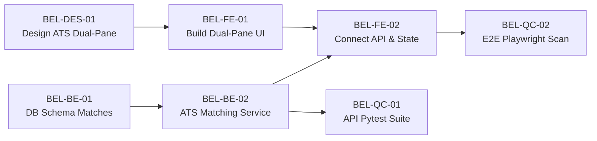
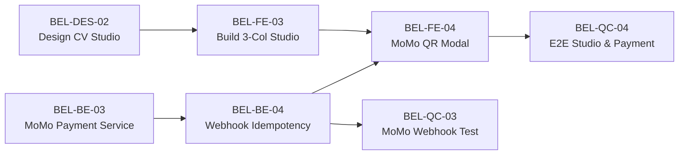
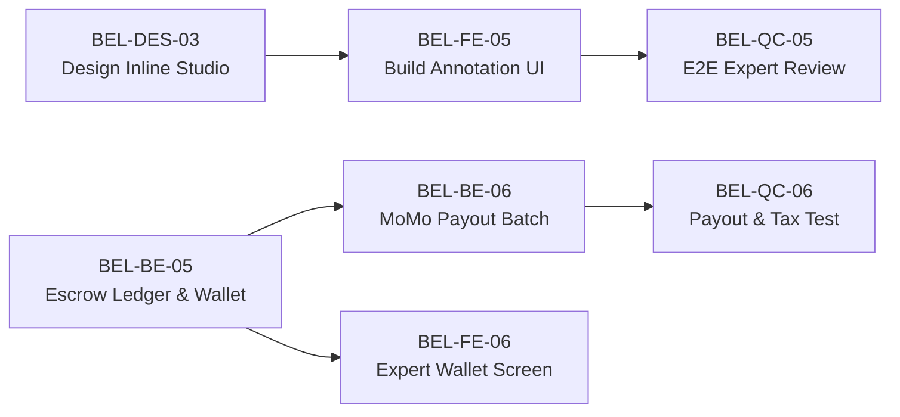

# Belooga Production Engineering Backlog & Task Breakdown (Phân Chia Công Việc Chuẩn Doanh Nghiệp)

> **Mã tài liệu:** `PLAN-003-SPRINT-BACKLOG`  
> **Tiêu chuẩn quản lý:** Agile Scrum / Linear-Jira Enterprise Format  
> **Quy ước mã vé (Ticket Prefix):** `BEL-[DES|BE|FE|QC|OPS]-[Số]`  
> **Nguyên tắc chất lượng:** Tuân thủ tuyệt đối *DoD (Definition of Done)* và *No Proof = Not Done*.

---

## 1. Cơ Cấu Tổ Chức & Trách Nhiệm Phân Vai (RACI Matrix)

| Vai trò (Role) | Ký hiệu | Trách nhiệm chính | Tiêu chuẩn bàn giao (Deliverables) |
|---|---|---|---|
| **Product & UI/UX Design** | `DES` | Thiết kế Wireframe, Component Tokens, Figma Tokens, Prototyping theo chuẩn Zero Dead-Space. | File Figma / SVG / Design Specs, 8px/4px Grid, Bảng màu Tailwind v4 semantic. |
| **Backend Engineering** | `BE` | Data Model, Migration, Service Layer, Pydantic Schemas, Tích hợp MoMo & Gemini Flash, Async Workers. | Migration Alembic sạch, Pytest coverage > 85%, OpenAPI 3.1 schema tự sinh, Sub-100ms P99 latency. |
| **Frontend Engineering** | `FE` | Next.js 16 (App Router), Tailwind v4, Zustand Store, Split-pane layout, PDF Vector Realtime rendering. | `bun x tsc --noEmit` pass 100%, 0 layout shift (CLS < 0.1), tương thích chuẩn bàn phím. |
| **Quality Control (QC)** | `QC` | Viết kịch bản kiểm thử E2E (Playwright), API Integration Test, Stress test, Chống hồi quy (Anti-regression). | Test Suites xanh 100% trong `qc/tests/`, video bằng chứng test pass, báo cáo đối soát bugs. |
| **DevOps & Security** | `OPS` | Docker Compose, Nginx Reverse Proxy, Cloudflare R2, Webhook HMAC Security, Giám sát tài nguyên VPS. | Script CI/CD, Nginx config giới hạn 5MB, Health probes `/health` 200 OK. |

---

## 2. Kế Hoạch Sprint 1: Core Foundation & ATS Diagnostics (Tuần 1 - 2)
*Mục tiêu Sprint: Ứng viên có thể dán JD bên ngoài vào -> Nhận ngay bảng phân tích điểm ATS và Gap từ khóa kỹ thuật.*

### [EPIC 1: AGENTIC ATS SCANNER & DUAL-PANE VIEW]

#### 🎨 [BEL-DES-01] Thiết Kế Chi Tiết Component Tokens & Wireframe Màn Hình ATS Diagnostics
- **Assignee:** `DES` | **Priority:** `P0` | **Story Points:** `3`
- **Mô tả:** Thiết kế layout Split-pane (45% chẩn đoán, 55% preview) chuẩn tỉ lệ Linear/Bloomberg.
- **Tiêu chí nghiệm thu (Acceptance Criteria - AC):**
  1. Có đủ trạng thái: Empty state, Loading skeleton khi đang quét, Error state (file quá 5MB/lỗi font), và Result state.
  2. Bảng mã màu cảnh báo chuẩn: Critical Alert (Đỏ - `#ef4444`), Missing Hard Skill (Cam - `#f59e0b`), STAR Metric Gap (Vàng - `#eab308`), Good (Xanh - `#10b981`).
  3. Giao diện toggle chuyển đổi giữa chế độ **Visual PDF View** và **Bot-Eye Raw View** (Text trần của ATS).

---

#### ⚙️ [BEL-BE-01] Thiết Kế Cơ Sở Dữ Liệu & Migration Bảng `job_descriptions` và `resume_jd_matches`
- **Assignee:** `BE` | **Priority:** `P0` | **Story Points:** `3` | **Dependencies:** None
- **Mô tả:** Tạo bảng mới bằng Alembic migration, đảm bảo khóa ngoại trỏ về `identities(id)`.
- **Đặc tả kỹ thuật:**
  - Bảng `job_descriptions`: `id (UUID)`, `raw_text (TEXT)`, `company_name (VARCHAR)`, `job_title (VARCHAR)`, `skills_extracted (JSONB)`, `created_at (TIMESTAMPTZ)`.
  - Bảng `resume_jd_matches`: `id (UUID)`, `user_id (UUID FK)`, `job_description_id (UUID FK)`, `ats_score (INT)`, `missing_skills (JSONB)`, `star_analysis (JSONB)`, `parse_warnings (JSONB)`.
- **AC:**
  1. Chạy `alembic upgrade head` không lỗi; `alembic downgrade -1` rollback sạch sẽ.
  2. Index GIN trên trường `skills_extracted` và `missing_skills` để hỗ trợ truy vấn lọc nhanh.

---

#### ⚙️ [BEL-BE-02] Xây Dựng Service Phân Tích ATS 2 Tầng (Heuristic TSVECTOR + Gemini Flash Cascade)
- **Assignee:** `BE` | **Priority:** `P0` | **Story Points:** `5` | **Dependencies:** `BEL-BE-01`
- **Mô tả:** Endpoint `POST /v1/ai/ats-scan` tiếp nhận PDF file hoặc text profile + nội dung JD.
- **Quy tắc bất biến:** Không blocking event loop (`asyncio.to_thread` khi đọc PDF), ép `max_tokens=800`, trả về Pydantic schema cố định.
- **AC:**
  1. Tầng 1: Dùng Regex + Python bóc tách hard skills từ `catalog_skills` trong < 50ms ($0 token).
  2. Tầng 2: Gọi Gemini 2.0 Flash phân tích câu thiếu số liệu STAR, parse thành JSON schema.
  3. Nếu file > 5MB hoặc > 3 trang, trả về HTTP `413 Payload Too Large` ngay lập tức.
  4. Response time toàn chu trình < 1,500ms đối với file PDF 2 trang.

---

#### 💻 [BEL-FE-01] Xây Dựng Khung Giao Diện Split-Pane Zero Dead-Space (`/ats-diagnostics`)
- **Assignee:** `FE` | **Priority:** `P0` | **Story Points:** `5` | **Dependencies:** `BEL-DES-01`
- **Mô tả:** Code Next.js 16 App Router tại `frontend/src/app/ats-diagnostics/page.tsx` sử dụng Tailwind CSS v4.
- **AC:**
  1. Giao diện full màn hình (100vh), không có thanh cuộn thừa ngoài màn hình, chia 2 cột resizable.
  2. Cột trái chứa Interactive Scorecard, thanh tiến trình điểm (Progress Ring), danh sách Accordion các kỹ năng bị thiếu.
  3. Cột phải chứa Document Canvas: Bật tắt mượt mà giữa chế độ Canvas PDF và chế độ Bot-Eye Monospace Raw Text.
  4. `bun x tsc --noEmit` pass 100% không warning.

---

#### 💻 [BEL-FE-02] Tích Hợp API Scan, Zustand Store & 1-Click Action Flow
- **Assignee:** `FE` | **Priority:** `P0` | **Story Points:** `3` | **Dependencies:** `BEL-BE-02`, `BEL-FE-01`
- **Mô tả:** Kết nối client Zustand store (`use-ats-diagnostics.ts`) với API backend.
- **AC:**
  1. Trạng thái Loading có animation mô phỏng bot ATS quét từng phần (Scanning Header -> Skills -> Metrics).
  2. Nút bấm `[+ Add to CV]` bên cạnh kỹ năng thiếu tự động kích hoạt drawer thêm nhanh vào profile.
  3. Nút `[1-Click Sửa Bằng Ly Cà Phê 29k]` mở modal thanh toán MoMo QR code.

---

#### 🧪 [BEL-QC-01] Bộ Kiểm Thử Tự Động Pytest Cho ATS Matching Engine
- **Assignee:** `QC` (phối hợp `BE`) | **Priority:** `P0` | **Story Points:** `3` | **Dependencies:** `BEL-BE-02`
- **Mô tả:** Viết test suite trong `backend/tests/test_ats_matching.py`.
- **AC:**
  1. Test case: Upload file PDF 1 trang chuẩn -> Đảm bảo trả về `ats_score` từ 0 - 100.
  2. Test case: Upload file > 5MB -> Bắt đúng mã lỗi HTTP 413.
  3. Test case: Upload JD có cố tình tiêm mã độc (Prompt Injection) -> Đảm bảo backend vẫn trả về đúng cấu trúc JSON, không bị phá vỡ schema.
  4. Lệnh chạy: `pytest backend/tests/test_ats_matching.py` pass 100%.

---

#### 🧪 [BEL-QC-02] Bộ Kiểm Thử E2E Playwright Cho Luồng Quét & Xem Bot-Eye
- **Assignee:** `QC` | **Priority:** `P0` | **Story Points:** `5` | **Dependencies:** `BEL-FE-02`
- **Mô tả:** Viết E2E test tại `qc/tests/ats-diagnostics.spec.ts`.
- **AC:**
  1. Tự động hóa: Mở trang `/ats-diagnostics` -> Dán JD mẫu -> Bấm "Quét CV".
  2. Kiểm tra hiển thị điểm số trên UI (`expect(scoreElement).toBeVisible()`).
  3. Bấm nút toggle "Bot-Eye View" -> Xác nhận giao diện chuyển đổi sang khối `<pre>` chứa raw text.
  4. Lệnh chạy: `cd qc && bun run test:e2e` xanh 100%.

---

## 3. Kế Hoạch Sprint 2: Pro CV Studio & MoMo Micro-Pass (Tuần 3 - 4)
*Mục tiêu Sprint: Ứng viên có thể tùy biến lề/font CV khít 1 trang A4 và mua gói sửa tự động 29,000đ qua MoMo.*

### [EPIC 2: PRO CV STUDIO (UI ADJUSTER) & MOMO PAY-IN]

#### 🎨 [BEL-DES-02] Thiết Kế Không Gian 3 Cột Pro CV Studio & Thanh Trượt Lề/Font
- **Assignee:** `DES` | **Priority:** `P0` | **Story Points:** `3`
- **AC:** Cung cấp thông số pixel chuẩn cho 3 cột (18% - 42% - 40%), thanh slider chỉnh margin (0.5in - 1.0in) và thước đo tỷ lệ chiếm trang (Page Budget Meter: hiển thị % độ dài trang).

---

#### ⚙️ [BEL-BE-03] Tích Hợp Cổng Thanh Toán MoMo Merchant QR API
- **Assignee:** `BE` | **Priority:** `P0` | **Story Points:** `5` | **Dependencies:** None
- **Mô tả:** Xây dựng endpoint `POST /v1/payments/momo/create-qr` sinh mã QR thanh toán cho gói Micro-Pass 29k và gói Expert Review.
- **AC:**
  1. Ký chữ ký số HMAC-SHA256 đúng chuẩn MoMo v2.
  2. Trả về `payUrl`, `qrCodeUrl`, `orderId` trong < 300ms.
  3. Đơn hàng lưu vào DB với trạng thái `PENDING`.

---

#### ⚙️ [BEL-BE-04] Xây Dựng MoMo IPN Webhook với Khóa Idempotency & Bảo Mật Chữ Ký
- **Assignee:** `BE` | **Priority:** `P0` | **Story Points:** `5` | **Dependencies:** `BEL-BE-03`
- **Mô tả:** Endpoint `POST /v1/payments/momo/ipn` tiếp nhận kết quả thanh toán từ MoMo.
- **AC:**
  1. Kiểm tra chữ ký HMAC-SHA256 từ MoMo gửi sang. Chữ ký sai -> trả về HTTP `400 Bad Request`.
  2. Sử dụng `SELECT ... FOR UPDATE` khóa bản ghi đơn hàng. Nếu trạng thái đã là `PAID` -> Bỏ qua, trả về `200 OK` (chống double-credit).
  3. Cập nhật lượt dùng gói Micro-Pass vào tài khoản user hoặc chuyển tiền vào Escrow nếu là đơn Expert.

---

#### 💻 [BEL-FE-03] Xây Dựng 3-Column Studio Workspace & Sliders Tùy Biến (`/cv-studio`)
- **Assignee:** `FE` | **Priority:** `P0` | **Story Points:** `8` | **Dependencies:** `BEL-DES-02`
- **Mô tả:** Trang `/cv-studio` hỗ trợ chỉnh sửa form STAR bên trái và xem trước PDF realtime bên phải.
- **AC:**
  1. Cột 1: Cây mục kéo thả (Drag-and-drop reorder) đổi chỗ Dự án / Kinh nghiệm.
  2. Cột 2: Các trường nhập liệu định lượng STAR với gợi ý Action-Verb.
  3. Cột 3: Thanh trượt Margin / Font size / Line spacing tự động cập nhật preview. Có nút **"Snap 1-Page"** tự động tính toán font size để vừa khít 1 trang A4.

---

#### 💻 [BEL-FE-04] Xây Dựng Dialog Quét Mã MoMo QR Realtime (Polling / WebSocket)
- **Assignee:** `FE` | **Priority:** `P0` | **Story Points:** `3` | **Dependencies:** `BEL-BE-03`, `BEL-BE-04`
- **Mô tả:** Modal hiển thị mã QR MoMo, đếm ngược thời gian thanh toán 10 phút.
- **AC:**
  1. Quét mã xong -> Tự động chuyển màn hình thành công trong 1.5 giây mà không cần người dùng bấm F5.
  2. Hiển thị rõ số tiền cố định (29,000đ) và mã đơn hàng.

---

#### 🧪 [BEL-QC-03] Bộ Kiểm Thử Chống Trùng Lặp Thanh Toán (Race-Condition & Replay Test)
- **Assignee:** `QC` | **Priority:** `P0` | **Story Points:** `5` | **Dependencies:** `BEL-BE-04`
- **Mô tả:** Dùng script giả lập bắn đồng thời 10 request Webhook MoMo giống hệt nhau vào backend.
- **AC:**
  1. Chỉ có đúng 1 request được cập nhật thành công, 9 request còn lại nhận `200 OK` nhưng không được cộng tiền 2 lần.
  2. Số dư lượt scan của user tăng chính xác 1 lần.

---

## 4. Kế Hoạch Sprint 3: Expert Review Studio & Escrow Payout (Tuần 5 - 6)
*Mục tiêu Sprint: Chuyên gia có thể chấm bài inline Figma-style trên CV, nộp bài nhận thù lao về ví MoMo sau khi trừ 8% phí sàn.*

### [EPIC 3: EXPERT FIGMA-STYLE STUDIO & ESCROW ENGINE]

#### 🎨 [BEL-DES-03] Thiết Kế Hệ Thống Inline Comment & Quick Tags Cho Chuyên Gia
- **Assignee:** `DES` | **Priority:** `P0` | **Story Points:** `3`
- **AC:** Thiết kế bóng comment nổi (Floating bubble), thanh công cụ ghim tag nhanh (`#NeedMetric`, `#Vague`, `#Mismatch`), và đồng hồ SLA đếm ngược trên header.

---

#### ⚙️ [BEL-BE-05] Xây Dựng Sổ Cái Escrow & Cơ Chế Trừ 8% Phí Sàn
- **Assignee:** `BE` | **Priority:** `P0` | **Story Points:** `5` | **Dependencies:** None
- **Mô tả:** Bảng `escrow_ledger` và Service quản lý chu trình dòng tiền: `HELD_IN_ESCROW` -> `RELEASED_TO_WALLET` -> `PAID_OUT`.
- **AC:**
  1. Đơn 350,000đ: Hệ thống tự động chia `28,000đ` (8% phí sàn cho Belooga) và `322,000đ` (92% cho Chuyên gia).
  2. Bắt buộc kiểm tra điều kiện chất lượng: Phải có ít nhất 3 ghi chú inline mới cho phép nộp bài.

---

#### ⚙️ [BEL-BE-06] Xây Dựng Cơ Chế Gom Đợt Rút Tiền (Batch Payout) & Tự Động Khấu Trừ Thuế TNCN
- **Assignee:** `BE` | **Priority:** `P1` | **Story Points:** `5` | **Dependencies:** `BEL-BE-05`
- **Mô tả:** Quản lý lệnh rút tiền về ví MoMo của Chuyên gia.
- **AC:**
  1. Chặn rút tiền dưới ngưỡng **500,000đ**.
  2. Nếu tổng thu nhập trong tháng > **2,000,000đ**: Bắt buộc yêu cầu MST cá nhân và tự động trích lại 10% thuế TNCN vãng lai.

---

#### 💻 [BEL-FE-05] Xây Dựng Giao Diện Inline Review Figma-Style (`/expert/studio/[orderId]`)
- **Assignee:** `FE` | **Priority:** `P0` | **Story Points:** `8` | **Dependencies:** `BEL-DES-03`
- **Mô tả:** Màn hình làm việc cho Chuyên gia với chức năng bôi đen đoạn văn bản trong CV để thả comment.
- **AC:**
  1. Bôi đen text trên CV -> Hiện popup nổi gõ comment + chọn Quick Tag.
  2. Cột phải hiển thị Barem 3 tiêu chuẩn chấm điểm và nút "Chèn gợi ý từ AI Co-pilot".
  3. Header hiển thị đồng hồ đếm ngược SLA thời gian thực (đổi màu đỏ khi còn < 4 giờ).

---

#### 💻 [BEL-FE-06] Xây Dựng Màn Hình Quản Lý Ví & Lịch Sử Thu Nhập Expert (`/expert/wallet`)
- **Assignee:** `FE` | **Priority:** `P1` | **Story Points:** `3` | **Dependencies:** `BEL-BE-05`
- **AC:** Hiển thị 3 thẻ số dư: *Khả dụng*, *Đang giữ trong Escrow*, *Đã rút thành công*. Form tạo lệnh rút tiền MoMo kèm cảnh báo thuế TNCN minh bạch.

---

#### 🧪 [BEL-QC-05] Bộ Kiểm Thử E2E Toàn Chu Trình Đặt Hàng -> Review -> Giải Ngân
- **Assignee:** `QC` | **Priority:** `P0` | **Story Points:** `5` | **Dependencies:** `BEL-FE-05`, `BEL-BE-05`
- **AC:** Kịch bản Playwright: User A đặt review -> Expert B mở studio bôi đen ghi chú -> Expert B bấm nộp bài -> Tiền tự động nhảy vào số dư khả dụng của Expert B.

---

## 5. Kế Hoạch Sprint 4: Job Kanban, Executive Dashboard & Production Readiness (Tuần 7 - 8)
*Mục tiêu Sprint: Bàn làm việc Kanban cho ứng viên, Dashboard tài chính cho Founder, nghiệm thu Production.*

| Ticket ID | Tên công việc | Vai trò | Điểm | Tiêu chí nghiệm thu cốt lõi (Core AC) |
|---|---|---|---|---|
| **BEL-FE-07** | Job Application Kanban Tracker (`/workspace/jobs`) | `FE` | 5 | Kéo thả 5 cột trạng thái mượt mà, lưu bản CV riêng theo từng công ty. |
| **BEL-BE-07** | Executive Analytics Engine & Aggregator | `BE` | 5 | API tổng hợp GMV, doanh thu ròng, quỹ Escrow Float trong < 100ms. |
| **BEL-FE-08** | Executive Financial Dashboard (`/admin/dashboard`) | `FE` | 5 | Biểu đồ Recharts doanh thu 4 tuần, danh sách giao dịch MoMo trực tiếp. |
| **BEL-OPS-01** | Docker Compose VPS Deployment & Cloudflare Hardening | `OPS` | 5 | Nginx giới hạn file 5MB, Cloudflare Turnstile chặn bot, VPS RAM < 2.5GB. |
| **BEL-QC-07** | Full Regression Suite & Security Audit Gate | `QC` | 8 | Chạy toàn bộ Pytest + E2E Playwright + `audit-truth.sh` pass 100%. |

---

## 6. Tiêu Chuẩn Nghiệm Thu Công Ty (Definition of Done - DoD Contract)

Trước khi đóng bất kỳ ticket nào sang cột **DONE**, bắt buộc phải thỏa mãn:
1. **Zero Lint/Build Errors:** Backend pass `ruff/flake8`, Frontend pass `bun x tsc --noEmit`.
2. **Automated Evidence:** Phải chạy test suite tương ứng và đính kèm lệnh test thành công vào PR (`No Proof = Not Done`).
3. **No Dead-Space:** Giao diện được kiểm tra trực quan trên màn hình Laptop 13-inch và Desktop 24-inch, không có khoảng trắng thừa lãng phí.
4. **Financial Safety:** Các endpoint liên quan đến tiền bạc (MoMo, Escrow) bắt buộc phải có chữ ký HMAC và DB Row-lock.
