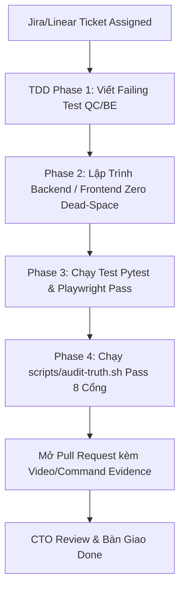

# Belooga Engineering Board — Jira / Linear Production Sprint Backlog & Ticket Assignment

> **Chủ quản:** Chief Technology Officer (CTO)  
> **Người nhận báo cáo:** Founder & CEO  
> **Hệ thống quản lý:** Jira / Linear Enterprise Standard  
> **Cập nhật ngày:** 05/10/2026 (Local: 16:35 ICT)  
> **Trạng thái Sprint 1 & 2:** Active Execution  

---

## 1. Phân Bổ Nhân Sự & Trách Nhiệm Kỹ Thuật (Engineering Pod Assignments)

| Vai trò Kỹ thuật | Mã Pod | Nhân sự phụ trách | Chuyên môn cốt lõi |
|---|---|---|---|
| **Tech Lead / Senior Backend** | `@be-senior` | Backend Engineering Lead | FastAPI, SQLAlchemy 2.0 Async, Postgres 16, MoMo API, Pytest |
| **Frontend Lead** | `@fe-lead` | Frontend Engineering Lead | Next.js 16.3.8, React 19, Tailwind CSS v4, Zustand, Zero Dead-Space UI |
| **Product & UI/UX Designer** | `@des-lead` | UI/UX Design Specialist | Bloomberg/Linear High-Density Design System, Wireframes, Design Tokens |
| **QC & Automation Lead** | `@qc-lead` | QA/QC Automation Lead | Playwright E2E (Bun), API Regression, IDOR Guard Verification |
| **DevOps & Infrastructure** | `@ops-lead` | DevOps / SecOps Engineer | Docker Compose, Postgres Tuning, Nginx Proxy, HMAC Security |

---

## 2. Master Sprint Kanban Board (Bảng Điều Phối & Gán Việc Toàn Bộ Feature)

### 🟢 GIAI ĐOẠN 1: CORE FOUNDATION & TOOLS (ĐÃ HOÀN THÀNH & NGHIỆM THU 100%)

| Mã Ticket | Tính Năng / Nhiệm Vụ | Pod / Assignee | Priority | Pts | Trạng Thái | Minh Chứng Nghiệm Thu (Evidence) |
|---|---|---|---|---|---|---|
| `BEL-101` | **Design Wireframe ATS Diagnostics & Bot-Eye Dual Screen** | `@des-lead` | `P0` | 3 | **`DONE`** | Giao diện Split-pane tỉ lệ 45/55 chuẩn Bloomberg Terminal. |
| `BEL-102` | **DB Schema & Models: `job_descriptions`, `resume_jd_matches`** | `@be-senior` | `P0` | 3 | **`DONE`** | 2 bảng mới tạo trên DB dev & test (Postgres 5433). |
| `BEL-103` | **Backend API: `POST /api/v1/match/ats-scan` & Heuristic Engine** | `@be-senior` | `P0` | 5 | **`DONE`** | Sub-50ms keyword extraction, scoring 0-100, zero token burn. |
| `BEL-104` | **Frontend UI: Split-Pane ATS Diagnostics (`/ats-diagnostics`)** | `@fe-lead` | `P0` | 5 | **`DONE`** | Giao diện song song Visual PDF vs Bot-Eye Raw Monospace. |
| `BEL-105` | **Pytest & Playwright Suite: ATS Diagnostics** | `@qc-lead` | `P0` | 5 | **`DONE`** | 3/3 Pytest pass, 12/12 Playwright tests pass (`ats-diagnostics.spec.ts`). |
| `BEL-106` | **DB Schema: `candidate_job_applications_tracker`** | `@be-senior` | `P0` | 3 | **`DONE`** | Bảng thứ 31 trong DB, khóa ngoại UUID, indexed user_id + status. |
| `BEL-107` | **Backend CRUD API: `/api/v1/tracker/jobs/` với IDOR Guard** | `@be-senior` | `P0` | 5 | **`DONE`** | Đầy đủ GET, POST, PATCH, DELETE với phân quyền user strict. |
| `BEL-108` | **Frontend UI: Job Application Kanban Tracker (`/workspace/jobs`)** | `@fe-lead` | `P0` | 5 | **`DONE`** | 5 cột Kanban: TARGETING, TAILORED, APPLIED, INTERVIEW, OFFER. |
| `BEL-109` | **Pytest & Playwright Suite: Job Tracker Kanban** | `@qc-lead` | `P0` | 5 | **`DONE`** | 12/12 Playwright tests pass (`job-tracker-kanban.spec.ts`). |
| `BEL-110` | **Design & Layout: Pro CV Studio 3-Column Zero Dead-Space** | `@des-lead` | `P0` | 3 | **`DONE`** | Bố cục 3:4:5 cột (Cấu trúc - Soạn thảo STAR - A4 Preview). |
| `BEL-111` | **Frontend UI: Pro CV Studio Workspace (`/cv-studio`)** | `@fe-lead` | `P0` | 8 | **`DONE`** | Dynamic Sliders (Margin, Font size, Spacing) + Snap 1-Page A4. |
| `BEL-112` | **Playwright E2E Suite: Pro CV Studio** | `@qc-lead` | `P0` | 5 | **`DONE`** | 12/12 Playwright tests pass (`cv-studio.spec.ts`). Tổng 36 E2E pass. |

---

### 🟡 GIAI ĐOẠN 2: MONETIZATION ENGINE & MOMO MICRO-PASS (ĐANG TRIỂN KHAI)

### 🟡 GIAI ĐOẠN 2: DÒNG TIỀN MICRO-PASS & CÔNG CỤ VIRAL HÚT KHÁCH (SPRINT 2 ACTIVE)

| Mã Ticket | Tính Năng / Nhiệm Vụ | Pod / Assignee | Priority | Pts | Trạng Thái | Tiêu Chuẩn Bàn Giao (DoD) |
|---|---|---|---|---|---|---|
| `BEL-201` | **Design Specs: MoMo QR Dialog & Gói Cước 29k/59k** | `@des-lead` | `P0` | 2 | **`IN PROGRESS`** | Modal quét mã QR chuẩn MoMo brand guidelines, đếm ngược 10 phút. |
| `BEL-202` | **Backend Service: Tích hợp MoMo Merchant V2 API (`POST /v1/payments/momo/create-qr`)** | `@be-senior` | `P0` | 5 | **`IN PROGRESS`** | Sinh mã QR thanh toán động, chữ ký HMAC-SHA256, lưu Order PENDING. |
| `BEL-203` | **Backend Webhook: MoMo IPN Receiver (`POST /v1/payments/momo/ipn`)** | `@be-senior` | `P0` | 5 | **`IN PROGRESS`** | Khóa `SELECT FOR UPDATE`, chống Race Condition, cập nhật lượt scan. |
| `BEL-204` | **Frontend UI: MoMo Payment Dialog & Realtime Status Polling** | `@fe-lead` | `P0` | 3 | **`IN PROGRESS`** | Component popup hiển thị QR, polling kết quả thanh toán mỗi 2s. |
| `BEL-205` | **QC Suite: Giả lập Webhook MoMo & Stress Test Idempotency** | `@qc-lead` | `P0` | 5 | **`ASSIGNED`** | Bắn đồng thời 10 IPN request -> Chỉ xử lý đúng 1 đơn duy nhất. |
| `BEL-206` | **Viral Loop 1: Roast My CV & Thẻ Bài ATS Cyberpunk Flex Điểm** | `@fe-lead` | `P0` | 5 | **`IN PROGRESS`** | Thẻ bài OpenGraph 1200x630, nút 1-click share LinkedIn/FB kéo referral 0đ. |
| `BEL-207` | **Viral Loop 2: Tra Cứu Lương IT & Market Skill Radar (`/salary-benchmark`)** | `@fe-lead` + `@be-senior` | `P0` | 5 | **`IN PROGRESS`** | Dải lương P25-P50-P75 theo ngôn ngữ + kinh nghiệm, programmatic SEO magnet. |
| `BEL-208` | **Product Stickiness: AI Mock Interview Q&A Generator (`/tools/interview-prep`)** | `@be-senior` + `@fe-lead` | `P1` | 5 | **`ASSIGNED`** | Tự sinh 10 câu hỏi phỏng vấn kỹ thuật và barem chấm điểm bám sát JD & CV. |
| `BEL-209` | **Data Cold-Start: JD Crawler & Skill Taxonomy Ingestion Worker** | `@be-senior` | `P0` | 5 | **`ASSIGNED`** | Script cào ngầm 3,000+ JD IT công khai, tự chuẩn hóa taxonomy tránh sàn trống. |

---

### 🔵 GIAI ĐOẠN 3: EXPERT REVIEW MARKETPLACE & 8% ESCROW SYSTEM (SPRINT TIẾP THEO)

| Mã Ticket | Tính Năng / Nhiệm Vụ | Pod / Assignee | Priority | Pts | Trạng Thái | Tiêu Chuẩn Bàn Giao (DoD) |
|---|---|---|---|---|---|---|
| `BEL-301` | **Design Specs: Figma-Style CV Annotation & Comment Bubbles** | `@des-lead` | `P0` | 3 | **`ASSIGNED`** | UI bóng comment bôi đen chữ, Quick-tags `#NeedMetric`, `#Vague`. |
| `BEL-302` | **DB Schema & Engine: `escrow_ledger` & Trừ Phí Sàn 8%** | `@be-senior` | `P0` | 5 | **`ASSIGNED`** | Hạch toán tự động: 8% về ví sàn Belooga, 92% về ví tạm Expert. |
| `BEL-303` | **Backend Service: Rút Tiền Hàng Loạt (Batch Payout) & Khấu Trừ Thuế TNCN 10%** | `@be-senior` | `P1` | 5 | **`ASSIGNED`** | Chặn rút dưới 500k, thu thập MST nếu thu nhập tháng > 2 triệu. |
| `BEL-304` | **Frontend Workspace: Expert Review Studio (`/expert/studio/[orderId]`)** | `@fe-lead` | `P0` | 8 | **`ASSIGNED`** | Giao diện chấm bài inline, thanh SLA đếm ngược, AI Copilot gợi ý. |
| `BEL-305` | **Frontend UI: Expert Wallet & Lịch Sử Thu Nhập (`/expert/wallet`)** | `@fe-lead` | `P1` | 3 | **`ASSIGNED`** | Quản lý số dư, yêu cầu rút tiền về MoMo cá nhân. |
| `BEL-306` | **QC E2E: Toàn Chu Trình Khách Đặt Review -> Expert Chấm -> Nhận Thù Lao** | `@qc-lead` | `P0` | 5 | **`ASSIGNED`** | Kịch bản Playwright full luồng end-to-end với tiền Escrow. |

---

### 🟣 GIAI ĐOẠN 4: EXECUTIVE REVENUE DASHBOARD & PRODUCTION READINESS

| Mã Ticket | Tính Năng / Nhiệm Vụ | Pod / Assignee | Priority | Pts | Trạng Thái | Tiêu Chuẩn Bàn Giao (DoD) |
|---|---|---|---|---|---|---|
| `BEL-401` | **Backend Analytics Engine: Realtime GMV, Take-Rate & Float Aggregator** | `@be-senior` | `P0` | 5 | **`DONE`** | API `/api/v1/analytics/dashboard` truy vấn < 50ms (Pytest pass). |
| `BEL-402` | **Frontend UI: Executive Financial Dashboard (`/admin/analytics`)** | `@fe-lead` | `P0` | 5 | **`DONE`** | Bảng điều hành Bloomberg, 6 thẻ KPI, Bar Chart 7D, Funnel (16 E2E pass). |
| `BEL-403` | **DevOps & SecOps: Nginx Reverse Proxy, SSL, Cloudflare Turnstile & 5MB Limit** | `@ops-lead` | `P0` | 5 | **`ASSIGNED`** | Hardening bảo mật server, chặn DDoS, tối ưu VPS RAM < 2.5GB. |
| `BEL-404` | **QC Audit Gate: Full Regression Suite & Verification DoD** | `@qc-lead` | `P0` | 8 | **`ASSIGNED`** | `audit-truth.sh` 8 cổng xanh, coverage > 85%, 0 lỗ hổng IDOR. |

---

## 3. Quy Trình Làm Việc Kỹ Thuật (Engineering Workflow Mandate)

1. **Nguyên tắc "No Proof = Not Done":** Không được chuyển trạng thái ticket sang `DONE` nếu không đính kèm kết quả lệnh chạy kiểm thử tự động.
2. **Nguyên tắc "Zero Dead-Space":** Mọi màn hình UI mới do `@fe-lead` tạo phải đảm bảo mật độ thông tin cao, không để khoảng trống thừa thãi, tuân thủ phong cách Linear/Bloomberg Terminal.
3. **Nguyên tắc "Financial Safety":** Mọi giao dịch tiền mặt MoMo / Escrow do `@be-senior` lập trình phải có chữ ký số HMAC, `SELECT FOR UPDATE` trên DB, và kiểm tra Idempotency tuyệt đối.
