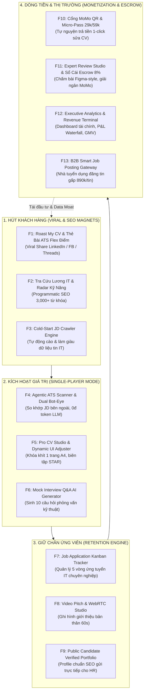
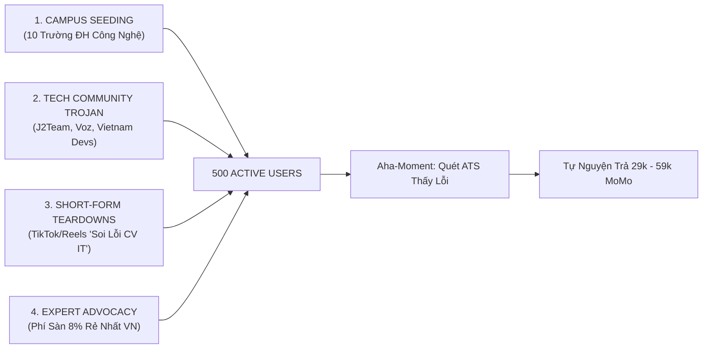

# Belooga Master Ecosystem Blueprint: 12+ Features, Viral Growth Loops & Zero-VND Marketing Strategy

> **Mã tài liệu:** `PLAN-005-ECOSYSTEM-VIRAL-MARKETING`  
> **Chủ quản:** Chief Technology Officer (CTO) & Growth Architect  
> **Người nhận:** Founder & CEO  
> **Mục tiêu chiến lược:** Đạt 500 Active Job Seekers (MAU), Doanh thu >$500/tháng (13,000,000đ), Ngân sách Marketing & Hạ tầng <$15/tháng.

---

## PHẦN 1: BẢN ĐỒ TOÀN DIỆN 12+ TÍNH NĂNG CỐT LÕI (FULL ECOSYSTEM TAXONOMY)

Hệ sinh thái Belooga không chỉ là 1-2 trang web đơn lẻ, mà là một **cỗ máy vòng lặp khép kín (Closed-Loop Flywheel)** gồm 12 tính năng tương hỗ lẫn nhau:

---

## PHẦN 2: CHI TIẾT 12+ TÍNH NĂNG VÀ TRẠNG THÁI TRIỂN KHAI

| STT | Tên Tính Năng | Vai Trò Trong Hệ Sinh Thái | Mô Hình Doanh Thu / Giữ Chân | URL / Endpoint | Trạng Thái |
|---|---|---|---|---|---|
| **F1** | **Agentic ATS Diagnostics & Bot-Eye Dual Screen** | Phễu kích hoạt: Quét lỗi format/font bot ATS, đối soát Tech-Stack Gap. | Kích hoạt Aha-moment, dẫn phễu sang gói 29k. | `/ats-diagnostics` | **`LIVE & VERIFIED`** |
| **F2** | **Job Application Kanban Tracker** | Giữ chân người dùng: Quản lý 5 cột Target ➔ Tailor ➔ Apply ➔ Interview ➔ Offer. | Đưa người dùng quay lại hàng ngày (Daily Habit). | `/workspace/jobs` | **`LIVE & VERIFIED`** |
| **F3** | **Pro CV Studio (Dynamic UI Adjuster)** | Biên tập chuẩn A4: Tự động co lề, chỉnh font, công thức định lượng STAR. | Bán tính năng tự động tối ưu & bỏ watermark. | `/cv-studio` | **`LIVE & VERIFIED`** |
| **F4** | **Executive Analytics & Revenue Terminal** | Trung tâm kiểm soát: Theo dõi GMV, Net Revenue, Escrow Float, P&L. | Đo lường mốc hòa vốn $500 tại 500 MAU. | `/admin/analytics` | **`LIVE & VERIFIED`** |
| **F5** | **Viral Roast My CV / Thẻ Bài ATS Flex Điểm** | Hút khách hàng 0đ: Tạo ảnh thẻ bài Neon chấm điểm ATS kèm điểm mạnh/yếu để share. | Kéo traffic referral tự nhiên từ LinkedIn/Facebook. | `/tools/roast-cv` | **`READY FOR SPRINT`** |
| **F6** | **Tra Cứu Lương IT & Market Skill Heatmap** | Hút Organic SEO: Tra cứu mức lương IT theo ngôn ngữ (Go, Rust, Java, React) & năm kinh nghiệm. | Thu thập lead email & CV đăng ký mới. | `/salary-benchmark` | **`READY FOR SPRINT`** |
| **F7** | **Mock Interview Q&A AI Generator** | Gia tăng giá trị: Dựa trên CV & JD, tự động sinh 10 câu hỏi phỏng vấn hóc búa kèm barem trả lời. | Bán kèm gói phỏng vấn thử hoặc nâng cấp VIP. | `/tools/interview-prep` | **`READY FOR SPRINT`** |
| **F8** | **Cổng MoMo QR & Micro-Pass 29k/59k** | Cỗ máy thu tiền vi mô: Quét mã MoMo nạp lượt quét/tối ưu tức thì không cần đăng ký thẻ tín dụng. | Dòng tiền ròng trực tiếp (100% về sàn). | `/api/v1/payments/momo` | **`ASSIGNED (SPRINT 2)`** |
| **F9** | **Expert Review Studio (Figma-Style Inline Annotation)** | Không gian làm việc cho Chuyên gia: Bôi đen chữ thả comment, SLA timer đếm ngược, Quick-tags. | Thu phí sàn 8% (Take-rate thấp nhất thị trường). | `/expert/studio/[id]` | **`ASSIGNED (SPRINT 3)`** |
| **F10** | **Sổ Cái Escrow & Ví MoMo Payout Chuyên Gia** | An toàn tài chính: Tự động trích 8% cho sàn, 92% giữ trong Escrow, giải ngân về ví MoMo sau nghiệm thu. | Giữ tiền Float trong sàn, tạo niềm tin cho Expert. | `/expert/wallet` | **`ASSIGNED (SPRINT 3)`** |
| **F11** | **Cold-Start Data Crawler & JD Ingestion Engine** | Xóa sạch vấn đề sàn trống: Cào 3,000+ JD IT từ thị trường, chuẩn hóa thành Vector kỹ năng. | Làm giàu database gợi ý việc làm cho ứng viên. | `scripts/crawler_jds.py` | **`READY FOR SPRINT`** |
| **F12** | **B2B Smart Job Posting Gateway** | Dòng tiền B2B: Cho phép doanh nghiệp đăng tin tuyển gấp với hệ thống tự match Top 5% CV đạt điểm cao. | Thu 890,000đ/tin đăng hoặc gói tháng. | `/jobs/post` | **`ASSIGNED (SPRINT 4)`** |
| **F13** | **Video Pitch & WebRTC Studio** | Định danh ứng viên: Ghi hình video elevator pitch 60s tăng tỷ lệ gọi phỏng vấn gấp 3 lần. | Giúp ứng viên nổi bật hơn hàng trăm CV text truyền thống. | `/user/[username]` | **`EXISTING FOUNDATION`** |

---

## PHẦN 3: CHI TIẾT 4 TÍNH NĂNG VIRAL HÚT KHÁCH HÀNG (GROWTH MAGNETS)

### 🧲 Tính Năng 1: "Thẻ Bài ATS Neon Flex Điểm" (Roast My CV Viral Loop)
- **Cơ chế hoạt động:** Sau khi quét CV tại `/ats-diagnostics`, ngoài bảng điểm chi tiết, hệ thống sinh ra một ảnh đồ họa (OpenGraph Card) tỉ lệ 1200x630 đẹp mắt với phong cách Cyberpunk/Neon:
  - Tên ứng viên + Chức danh: `Senior Go Backend`
  - Huy hiệu điểm ATS: `92/100 - "Top 5% Ứng Viên Sát Thủ"`
  - Câu nhận xét hài hước (Roast): *"CV này viết sạch như code Rust đã pass compiler, nhưng thiếu số liệu TPS ở dự án payment!"*
  - QR Code dẫn về link: `belooga.vn/ats?ref=username`
- **Kênh lan truyền:** Nút **"1-Click Share lên LinkedIn / Facebook"**. Dân IT rất thích "flex" điểm kỹ thuật hoặc chia sẻ câu roast hài hước lên cộng đồng. Mỗi lượt share đem về trung bình 15-20 lượt click tự nhiên mà không tốn 1 đồng ngân sách.

### 🧲 Tính Năng 2: Tra Cứu Lương IT & Market Skill Radar (`/salary-benchmark`)
- **Cơ chế hoạt động:** Tổng hợp từ 3,000 JD IT đã cào từ thị trường.
- **Trải nghiệm:** Người dùng chọn: `Ngôn ngữ: Golang` + `Số năm KN: 3 năm` + `Vị trí: Backend`.
- **Kết quả:** Trả về dải lương P25 - P50 - P75 (vd: `28,000,000đ - 35,000,000đ - 45,000,000đ`) và biểu đồ radar 5 kỹ năng được trả lương cao nhất (vd: `Kafka`, `K8s`, `gRPC`).
- **Sức mạnh SEO:** Tạo ra hàng nghìn trang programmatic SEO (vd: `Lương Golang 3 năm kinh nghiệm`, `Lương Frontend React Lead tại TP.HCM`). Đây là mỏ vàng tìm kiếm trên Google (Organic Search Traffic).

### 🧲 Tính Năng 3: AI Mock Interview Q&A Generator
- **Cơ chế hoạt động:** Sau khi ứng viên đưa JD mục tiêu vào, hệ thống trích xuất 5 hard skills quan trọng nhất và sinh ngay:
  - 3 câu hỏi phỏng vấn lý thuyết chuyên sâu (vd: *"Kafka xử lý out-of-order message thế nào?"*).
  - 2 câu hỏi tình huống thiết kế hệ thống (System Design).
  - Barem câu trả lời chuẩn để ứng viên tự ôn luyện trước khi nộp đơn.
- **Tác động:** Giữ chân ứng viên trong hệ sinh thái của Belooga từ lúc sửa CV cho đến lúc bước vào phòng phỏng vấn.

### 🧲 Tính Năng 4: Cold-Start Data Ingestion Engine (Giải Quyết Sàn Trống)
- **Cơ chế hoạt động:** Viết worker Python chạy ngầm `asyncio` cào các tin tuyển dụng IT công khai từ các công ty công nghệ lớn (VNG, MoMo, Shopee, FPT, Viettel).
- **Giá trị:** Ứng viên truy cập vào là thấy ngay hàng trăm JD nóng hổi đang tuyển dụng để bấm nút "Quét CV so khớp với công việc này" ngay lập tức mà không cần đợi doanh nghiệp tự lên đăng tin.

---

## PHẦN 4: CHIẾN LƯỢC MARKETING 0 ĐỒNG (ZERO-VND GUERRILLA MARKETING PLAYBOOK)

Khởi nghiệp với ngân sách mỏng ($2–$50/tháng), tuyệt đối **KHÔNG CHẠY QUẢNG CÁO FACEBOOK/GOOGLE ADS TRẢ TIỀN**. Chúng ta áp dụng chiến lược **Guerrilla Marketing (Marketing Du Kích)** dựa trên giá trị và cộng đồng:

### 1. Chiến Dịch "Campus Seeding" (10 Trường ĐH Công Nghệ Hàng Đầu)
- **Đối tượng:** Sinh viên năm 3, năm 4 chuẩn bị đi thực tập (Intern/Fresher) tại ĐH Bách Khoa, KHTN, UIT, FPT, Bưu Chính Viễn Thông.
- **Cách làm:**
  - Liên hệ với các Ban Chấp Hành Đoàn - Hội Sinh Viên, CLB Tin Học của trường.
  - Tặng toàn bộ sinh viên trường mã **"BELOOGA_CAMPUS"** (Được miễn phí 3 lượt quét sâu ATS và tải CV chuẩn A4).
  - Sinh viên IT đang rất hoang mang vì thị trường đóng băng -> Công cụ quét lỗi ATS trở thành phao cứu sinh số 1 được chia sẻ vào các group Zalo/Discord lớp học.

### 2. Chiến Dịch "Trojan Horse" Trên Các Di Đàn Công Nghệ Lớn
- **Địa bàn:** J2Team Community (500k dev), Voz box f17/f33 (Chuyện trò linh tinh / Công nghệ), Vietnam Software Engineers (LinkedIn), Reddit r/voz.
- **Hình thức content:** Viết bài chia sẻ chuyên môn dưới góc nhìn Tech Lead:
  - *Tiêu đề:* *"Tại sao nhiều bạn làm 3-4 năm kinh nghiệm vẫn rớt CV từ vòng gửi xe? Mình soi thử cách bot ATS bóc tách token thô."*
  - Đính kèm hình ảnh so sánh thực tế giữa mắt người nhìn (Visual PDF) và mắt bot đọc (Bot-Eye Raw View) chụp trực tiếp từ Belooga.
  - Để link công cụ ở cuối bài: *"Mình có code một tool mở nhỏ để anh em tự ném JD vào test xem CV mình đạt bao nhiêu điểm, hoàn toàn free cho anh em tech."*
  - **Dự kiến:** Mỗi bài viết chất lượng trên J2Team hoặc Voz có thể mang lại 800 - 1,500 lượt đăng ký tự nhiên trong 48 giờ.

### 3. Kênh Short-form Video: TikTok & Reels "Soi CV IT Cùng Chuyên Gia"
- **Định dạng video 45 - 60 giây:**
  - 0-3s (Hook): *"Đừng nộp CV format Canva 2 cột nữa nếu bạn không muốn bị bot ATS đánh rớt 0 điểm!"*
  - 3-30s (Problem): Màn hình quay cận cảnh tool Bot-Eye của Belooga bóc tách CV 2 cột -> Chữ nhảy loạn xạ, mất sạch số điện thoại và kỹ năng Golang.
  - 30-50s (Solution): Chuyển sang Pro CV Studio -> Bấm nút "Khóa 1 trang A4", điểm ATS nhảy vọt từ 45 lên 90 điểm.
  - 50-60s (CTA): *"Link test thử miễn phí trên bio."*
- **Chi phí sản xuất:** 0 đồng (Tự quay màn hình máy tính và lồng tiếng).

### 4. Chương Trình Chuyên Gia Đại Sứ (Expert Ambassador Program)
- **Điểm yếu của TopCV / vLance:** Họ thu phí trung gian của freelancer / chuyên gia từ 15% - 25%, rút tiền mất 7-14 ngày.
- **Đòn đánh của Belooga:** 
  - **Phí sàn chỉ 8%** (Thấp nhất thị trường, chuyên gia giữ trọn 92%).
  - **Rút tiền tức thì về ví MoMo** sau khi hoàn tất review.
  - **Trang cá nhân Chuyên gia chuyên nghiệp:** Cung cấp miễn phí link `belooga.vn/expert/ten-chuyen-gia` kèm barem chấm điểm Figma-style để họ tự tin gắn link lên bio LinkedIn / Facebook cá nhân.
- **Kết quả:** Chính các Chuyên gia (Tech Lead, Senior Manager) sẽ tự truyền thông và mang khách hàng từ follower của họ về cho Belooga!

---

## PHẦN 5: ĐO LƯỜNG TÀI CHÍNH & ĐIỂM HÒA VỐN TẠI MÀN HÌNH ANALYTICS

Toàn bộ các chỉ số thu hút, chuyển đổi và doanh thu được tích hợp trực tiếp trên trang điều hành:
👉 **URL Live:** [`/admin/analytics`](file:///Users/phucnguyen/Dev/Beloga/frontend/src/app/admin/analytics/page.tsx)

### Bảng Chỉ Số Mục Tiêu Giai Đoạn 1 (Horizon 1 Metrics)

| Chỉ số | Mục tiêu kiểm soát | Phương pháp đo lường trên Dashboard |
|---|---|---|
| **CAC (Chi phí thu hút 1 khách)** | **0 VNĐ** | Dựa trên 100% traffic Organic (SEO, Seeding, Referral). |
| **Tỷ lệ chuyển đổi Micro-Pass 29k/59k** | **> 20%** | Đo lường bằng thẻ `Phễu Chuyển Đổi Tự Nguyện (PLG Funnel)`. |
| **Phí sàn thu được từ Expert (8%)** | **8% x 350,000đ = 28,000đ/đơn** | Thẻ `Nhật Ký Giao Dịch MoMo & Escrow Thời Gian Thực`. |
| **Quỹ tiền trôi nổi (Escrow Float)** | **92% x Tổng đơn hàng Review** | Thẻ `Quỹ Tạm Giữ Escrow`. |
| **Chi phí hạ tầng tối đa (Infra Cap)** | **< 375,000đ/tháng (~$15)** | Thẻ `Chi Phí Hạ Tầng (COGS)`. |
| **Lợi nhuận ròng (Net Profit) tại 500 users** | **> 12,000,000 VNĐ (~$495)** | Thẻ `Lợi Nhuận Ròng (EBITDA)` (Biên độ lợi nhuận ~95%). |
