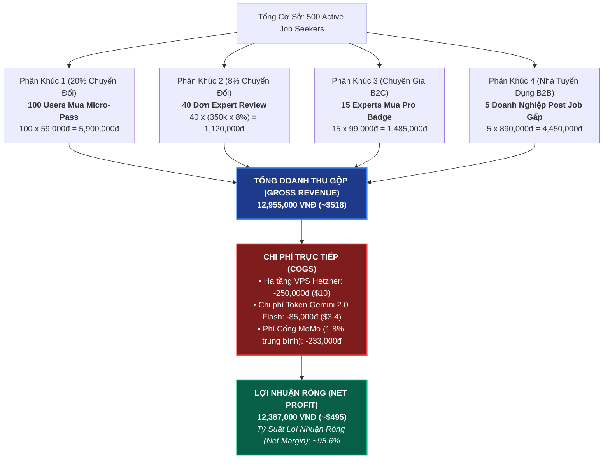
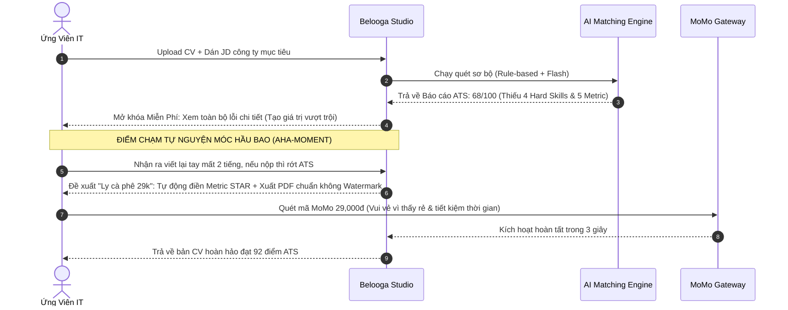
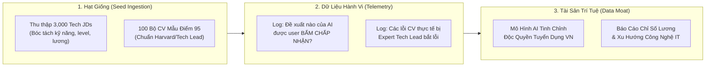
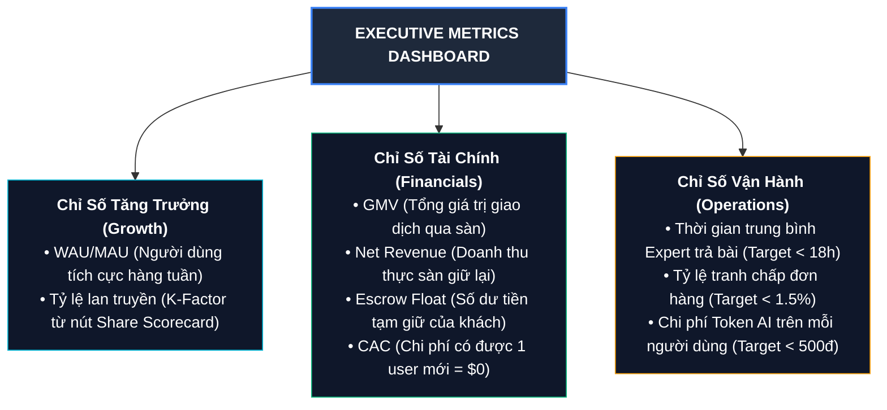

# Belooga Master Strategic Blueprint (Kế Hoạch Chiến Lược Kinh Tế & Công Nghệ)

> **Tài liệu chiến lược cấp điều hành (Executive Strategic Document)**  
> **Tác giả:** CTO & Co-founder  
> **Thị trường mục tiêu:** IT / Tech Talent Ecosystem (Việt Nam)  
> **Mục tiêu tài chính:** Điểm hòa vốn (Break-even) & Đạt >$500/tháng tại mốc 500 Active Users với ngân sách hạ tầng <$15/tháng.

---

## 1. Master Mindmap: Hệ Sinh Thái Nền Tảng Belooga

Sơ đồ tổng quan toàn bộ hệ sinh thái kinh doanh, luồng giá trị và các điểm chạm doanh thu (Monetization Touchpoints):

```mermaid
flowchart TD
    Root["<b>BELOOGA PLATFORM</b><br><i>Hệ Sinh Thái Hướng Nghiệp & Tuyển Dụng IT</i>"]

    %% Trụ cột 1
    Root --> P1["<b>1. CANDIDATE ECOSYSTEM</b><br>(Chiến Lược PLG - Hút Ứng Viên)"]
    P1 --> P1_Free["Free Value: ATS Diagnostic<br>• Quét lỗi format/font bot ATS<br>• Đối soát Tech-Stack Gap<br>• Chấm điểm thành tựu STAR"]
    P1 --> P1_Micro["Micro-Monetization (29k - 59k)<br>• 1-Click Tailor CV theo JD<br>• Tải PDF chuẩn ATS không Watermark<br>• Bộ câu hỏi phỏng vấn Mock Q&A"]
    P1 --> P1_Retention["Retention Engine<br>• Kanban Application Tracker<br>• Tech Salary Benchmark Index"]

    %% Trụ cột 2
    Root --> P2["<b>2. EXPERT MARKETPLACE</b><br>(Mô Hình Kinh Tế 2 Chiều)"]
    P2 --> P2_Studio["Review Studio (Năng Suất x3)<br>• Inline Annotations dạng Figma<br>• AI Pre-flight Checklist<br>• Quick Tags chuyên môn"]
    P2 --> P2_Econ["Cơ Chế Kinh Tế Đột Phá<br>• Phí sàn siêu thấp: 8% Take-Rate<br>• Rút tiền tức thì qua Ví MoMo<br>• Escrow giữ tiền an toàn"]
    P2 --> P2_Branding["Personal Brand Booster<br>• Landing Page chuyên gia cá nhân<br>• Gói Pro Creator Badge (99k/tháng)"]

    %% Trụ cột 3
    Root --> P3["<b>3. B2B EMPLOYER GATEWAY</b><br>(Dòng Tiền Cao Giai Đoạn 2)"]
    P3 --> P3_Post["Smart Job Intake<br>• Chuẩn hóa JD thành Skill Vector<br>• Đăng bài thử nghiệm (890k/tin)"]
    P3 --> P3_Matching["Reverse Recruitment<br>• Auto-match Top 5% CV Verified<br>• Giảm 80% thời gian lọc CV rác"]

    %% Trụ cột 4
    Root --> P4["<b>4. DATA & INFRASTRUCTURE MOAT</b><br>(Hạ Tầng Tối Thiểu - Giá Trị Tối Đa)"]
    P4 --> P4_Infra["Frugal Stack: $10 - $14/tháng<br>• 1 VPS Hetzner / Vietnix ($7-$10)<br>• Cloudflare R2 + Turnstile ($0)<br>• Gemini 2.0 Flash Cascade ($3)"]
    P4 --> P4_Data["Cold-Start Data Flywheel<br>• Cào 3,000 JDs IT chuẩn hóa Taxonomy<br>• Thu thập Feedback & Telemetry<br>• Fine-tune Model độc quyền"]

    %% Styling
    style Root fill:#1e293b,stroke:#3b82f6,stroke-width:3px,color:#ffffff
    style P1 fill:#0f172a,stroke:#06b6d4,stroke-width:2px,color:#ffffff
    style P2 fill:#0f172a,stroke:#10b981,stroke-width:2px,color:#ffffff
    style P3 fill:#0f172a,stroke:#f59e0b,stroke-width:2px,color:#ffffff
    style P4 fill:#0f172a,stroke:#8b5cf6,stroke-width:2px,color:#ffffff
```

---

## 2. Mô Hình McKinsey 3 Chặng Tăng Trưởng (Three Horizons of Growth)

Chiến lược phát triển thực chiến giúp bảo toàn vốn mỏng và tối đa hóa khả năng sống sót:

```mermaid
flowchart LR
    subgraph H1["CHẶNG 1 (Tháng 1 - 3)\nSingle-Player Utility & Validation"]
        direction TB
        H1_Focus["<b>Trọng tâm:</b> Công cụ độc lập<br>• AI ATS Scanner miễn phí<br>• External JD Matching<br>• 20 - 30 Chuyên gia hạt giống"]
        H1_Rev["<b>Doanh thu:</b> $0 - $150/tháng<br>• Bán thử nghiệm Micro-Pass 29k<br>• Đơn review đầu tiên"]
        H1_Cost["<b>Chi phí:</b> ~$12/tháng (Hạ tầng VPS)"]
    end

    subgraph H2["CHẶNG 2 (Tháng 4 - 6)\nLiquidity & Micro-Monetization"]
        direction TB
        H2_Focus["<b>Trọng tâm:</b> Kích hoạt thanh khoản<br>• Đạt mốc 500 Active Users<br>• MoMo Payout Escrow mượt mà<br>• Đóng gói các tính năng trả phí tự nguyện"]
        H2_Rev["<b>Doanh thu:</b> > $500/tháng (~13tr VNĐ)<br>• Đạt điểm hòa vốn và có dòng tiền dương"]
        H2_Cost["<b>Chi phí:</b> ~$18/tháng (VPS + Token AI Flash)"]
    end

    subgraph H3["CHẶNG 3 (Tháng 7 - 12)\nB2B Enterprise & Data Moat"]
        direction TB
        H3_Focus["<b>Trọng tâm:</b> Mở cổng Doanh nghiệp<br>• B2B Talent Pool (Reverse Hiring)<br>• Báo cáo thị trường IT Tech Heatmap<br>• Độc quyền dữ liệu CV IT Việt Nam"]
        H3_Rev["<b>Doanh thu:</b> $2,000 - $5,000+/tháng<br>• Doanh nghiệp trả gói tuyển dụng định kỳ"]
        H3_Cost["<b>Chi phí:</b> ~$45/tháng"]
    end

    H1 --> H2 --> H3
```

---

## 3. Mô Hình Tài Chính Chi Tiết: Thác Doanh Thu Tại Mốc 500 Users (P&L Waterfall)

Dưới góc độ phân tích kinh tế vi mô, đây là mô hình giải trình dòng tiền khi nền tảng đạt **500 Monthly Active Job Seekers (MAU)**:

---

## 4. Tâm Lý Học Định Giá: "Free Nhưng Tự Nguyện Móc Hầu Bao Vui Vẻ"

Belooga áp dụng **Product-Led Growth (PLG)** kết hợp kỹ thuật **Decoy Pricing & Micro-Commitment**:

---

## 5. Chiến Lược Hạt Giống Dữ Liệu (Cold-Start Data Flywheel)

Từ con số 0 dữ liệu, Belooga xây dựng **Rào cản phòng thủ dữ liệu (Data Moat)** theo 3 bước:

---

## 6. Khung Đo Lường & Bảng Điều Khiển Cấp Quản Trị (Executive KPI Dashboard)

Bảng phân bổ các chỉ số sống còn mà Founder & CTO cần theo dõi hàng ngày:

